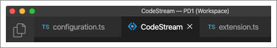

CodeStream was designed to sit alongside the editor pane in your IDE. The Current File tab in CodeStream really highlights why this is the case. It provides a Google Docs-style view of all of the comments in your currently selected source file. As you scroll up and down in the file, the comments scroll as well so that they remain next to the blocks of code that they refer to. Commenting on code is as easy as selecting a block of code and then clicking on the comment button that appears to its right.

When you first install the extension, the CodeStream pane should automatically appear at the right side of your IDE, in a separate pane from your editor pane. Unfortunately, because VS Code doesn't give us a lot of control over the pane in which CodeStream resides, it's possible to end up in situations where CodeStream is represented as another tab in your editor pane.

To get CodeStream back into its own pane, simply drag the tab to the right side of your IDE until you see the gray highlight appear on just the right side of the window.

