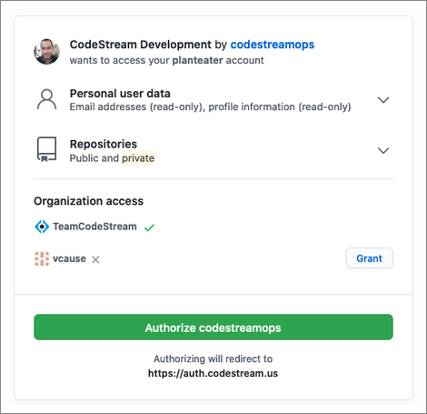
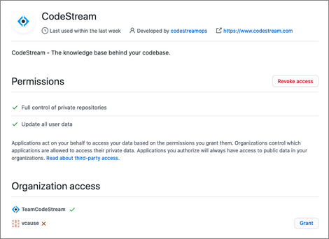

When you connect to GitHub as part of creating an issue codemark, all of the
repos you have access to should be available for selection. If repos from any of
your organizations are missing, it's probably because at the time you
authenticated with GitHub, you didn't grant access to all of your organizations.

If you didn't click on that Grant button at authentication time, simply go to
GitHub and navigate to Settings > Applications and click on the Authorized OAuth
Apps tab. From there, click on the CodeStream application. On the following
page, click the Grant button next to any organizations that you'd like to
be able to access from CodeStream.

