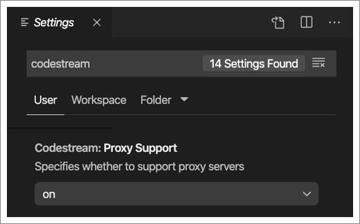

If you are experiencing connectivity issues with the CodeStream extension it could be because you’re behind a network proxy and CodeStream is not configured to work with it. To find CodeStream’s settings in your IDE:

* VS Code - Go to Settings/Preferences and search for “CodeStream”.
* Visual Studio - Go to Tools > Options > CodeStream.
* JetBrains - Go to Settings/Preferences > Tools > CodeStream.
* Atom - Go to Settings/Preferences > Packages, and then find CodeStream in the Community Packages section. Click on the Settings button in the CodeStream box.

Look for the “Proxy Support” setting and make sure it is set to “on”. For example, here's what the setting looks like in VS Code.

If you have proxy support configured in your IDE, CodeStream will first try to inherit those settings. Otherwise, CodeStream will inherit proxy settings from your operating system/environment.

After changing your selection here, restart your IDE.