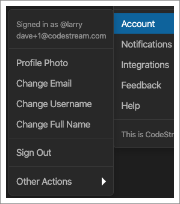

Look for the “Account” menu under the ellipses menu at the top of the CodeStream
pane and you’ll find options for changing your profile photo, username, full
name and email address. 

Note that when you change your email address, the old one will remain in effect
until you click on the link in the confirmation email sent to you.

If you would like to cancel your CodeStream account look for the option to do so
under Other Actions.
