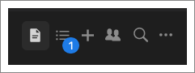
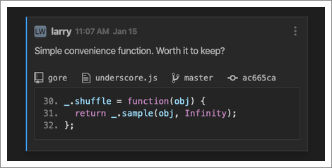
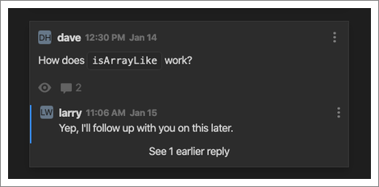
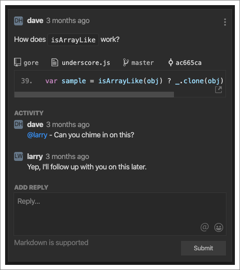

The activity feed is the definitive place to find out about new codemarks posted
by your teammates, or new replies to existing codemarks. When you’re not on the
activity feed, you can always tell whether or not there’s anything new by
looking for a badge on the Activity Feed icon. A blue badge with a white dot
means that there are new codemarks or replies, and a blue badge with a number
inside means that there are new codemarks or replies where you’ve been mentioned
(with the number indicating the number of mentions).

Note that CodeStream’s entry in your IDE’s status bar also let’s you know when
there are new messages in the feed. A dot to the right of your username means
there are new messages, and a number means there are new mentions.

As you might expect, new stuff gets added to the top of the feed, even if it’s a
new reply to a very old codemark. CodeStream makes it even easier to identify
what’s new by adding a blue border on the left side. For example, here’s a new
codemark at the top of the feed.

And here is a new reply to a codemark. The fact that only the replies have the
blue border means that you’ve previously seen the codemark itself.

Also note the “See 1 earlier reply”. That means that there an earlier reply that
you’ve already seen. Only new, unread replies are displayed in the main activity
feed view, but you can click on that link (or anywhere in the codemark) to see
the full discussion thread and add a new reply of your own.

The activity feed goes all the way back to the beginning of time for your team,
but if you’re looking for specific older codemarks you might be better off going
to the [Search tab](filter-and-search).
