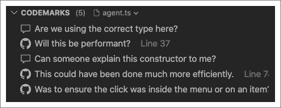
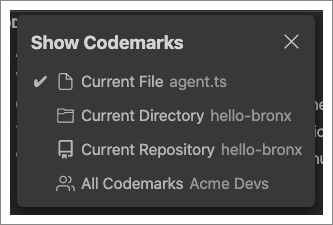
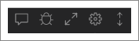
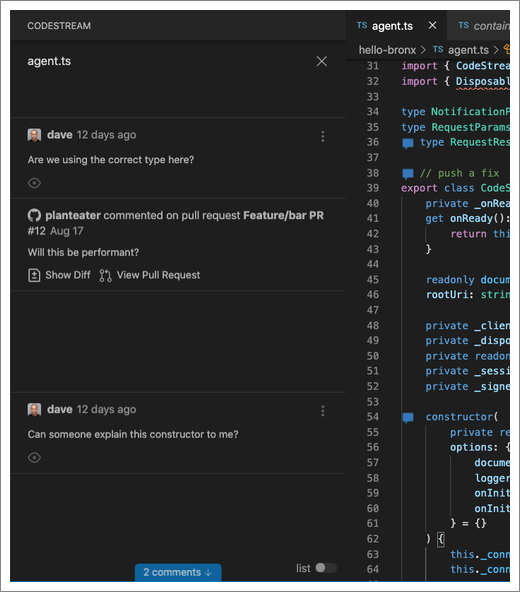

Whether they originated in a pull request, a feedback request, or through ad-hoc
code comments/issues, "codemarks" are the [discussions](../workflow/discuss-code) that annotate your
codebase. The Codemarks section of the CodeStream pane lists all of the
codemarks in the currently selected file for easy reference.

Click on any item to review the details and discussion. With the exception of
pull-request comments, bubbles to the right will indicate the number of replies.

Click on the filename dropdown to expand the list to include all codemarks in
the current directory, the current repo, or even everything in your team.

When you hover over the Codemarks section heading, icons appear at the right.

Included are options to create a code comment or issue. You can also choose to
view the codemarks in "spatial view", instead of in a list. If you've ever
commented on a Google Doc, spatial view will be a familiar concept. The
discussions are displayed alongside the blocks of code they refer to, and as you
scroll the source file the discussions scroll as well. It's a great way to
review codemarks in a section of a file you're about to work on.

Click on the gear icon for more controls over the list.

* Wrap multi-line comments - Rather than showing just a (possibly truncated)
  comment/issue title, the entirety of the post is displayed in the list.
* Show hidden/archived codemarks - Comments and issues that have been
  archived/resolved will be included in the list.
* Show comments from pull requests - Include [comments from pull
  requests](../workflow/pull-requests/#leveraging-pull-request-comments) in the list.
* Sort comments by date - Codemarks are, by default, listed in the order in
  which they appear in the file. Or by file, when viewing more than just the
  codemarks in the current file. You can alternatively sort by date. 