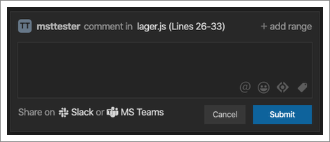
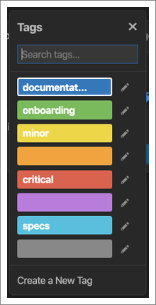
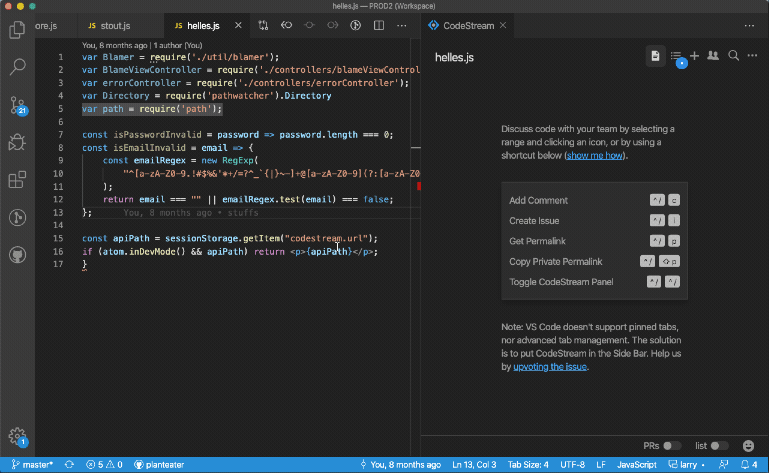
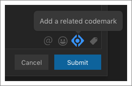
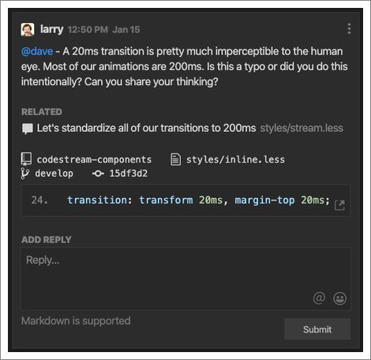

The [introduction to
codemarks](../gettingStarted/code-discussion-with-codemarks) covered, at a high
level, how to create a codemark and how codemarks are the building blocks of
your team’s knowledge base. Let’s dive into some more detail on the different
features of codemarks that you can leverage.

## Comments vs. Issues

There are two different types of codemarks; comments and issues. The main
difference between the two is that an issue has a title, can have an assignee,
and can also be marked “resolved” when appropriate. After selecting some code,
look for the menu the appears to the right in the CodeStream pane. The first
option is for creating a comment codemark, and the second is for creating an
issue codemark.

A comment codemark can be used for just about anything. Ask a question, make a
suggestion, or document some code. On the other hand, maybe you come across an
issue in the code, or maybe there’s some tech debt that needs to be tracked.
Whatever the case may be, when you want to make sure something gets done, create
an issue and add an assignee.

CodeStream also allows you to create issues in external issue-tracking services,
like Jira, Trello or GitHub. Just select your service of choice from the
dropdown list.

[Read more about CodeStream’s issue-tracking integrations.](issue-tracking-integrations)

## Sharing to Slack or Microsoft Teams

When you post a codemark your teammates will get notified via the activity feed,
and potentially via email. Sometimes, though, you might want to share the
codemark out to Slack or Microsoft Teams as well. Sharing on those platforms may
allow you to reach people more urgently, or simply reach people who don’t spend
a lot of time in their IDE. 

Click on either the Slack or Teams link at the bottom of the codemark form to
connect. Detailed instructions for setting up and using the integrations can be
found here for [the Slack integration](slack-integration) and here for [the
Microsoft Teams integration](msteams-integration).

## Tags

Look for the tag icon inside the codemark compose box to either select a tag or
create a tag using any combination of color and text label.

Tags are a great way to broadly organize and group your team’s codemarks, and
the possibilities here are endless. Here are just a few examples.

* Create a set of codemarks that help introduce a codebase to new developers and
  tag them all with “Onboarding”.
* When identifying issues in the code you could tag those that need to be
  addressed asap with a red “Critical” tag.
* Identify which parts of the codebase represent tech debt with the tag
  “Refactor” and colored by priority.

Note that you can also filter by tag on the Search tab.

## Multiple Ranges

Many discussions about code involve more than just one block of code, and
concepts are often best presented when you can refer to multiple code locations
at once. To create a multi-range codemark, select the first range and then “Add
Comment” or “Add Issue”. From the compose form, look for the “+ add range” link
at the top-right. You can then select another block of code from the same file,
a different file, or even a different repo.

Once you've created the codemark, you can easily jump between the different
locations by clicking the Jump icon at the bottom-right of each code block. Note
that the codemark will be displayed to the right of each code range in the
Current File view of CodeStream (i.e., you’ll see the same codemark multiple
times).

## Related Codemarks

Click on the CodeStream icon in the codemark compose form to select other,
related codemarks to “attach” to the current codemark. This allows you to easily
establish a connection between different parts of a codebase. For example, when
a change to one part of the codebase would require a change to another part,
identify the dependency by creating two related codemarks.

Once you’ve added the related codemarks they’ll be displayed in a “Related”
section and you can click on any one to jump to that codemark and the
corresponding section of the code.

