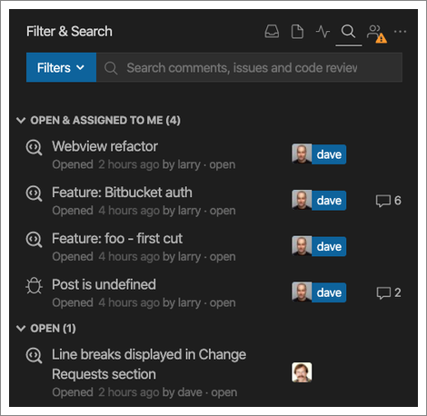
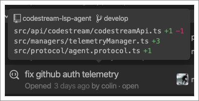
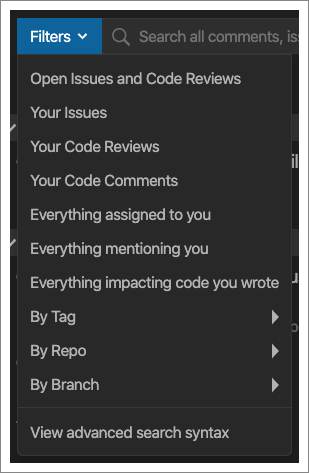
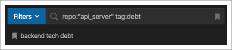

The Filter & Search tab allows you to slice and dice your team’s collection of
codemarks and code reviews however you see fit. By default, you’ll get a view of
any open issues or code reviewers assigned to you, followed by all open issues
and code reviews.

Hover over any codemark or code review in the list to get more details.

CodeStream provides a number of powerful predefined filters to make things easy.

But you can also use advanced search syntax (see below for full list) to create
your own, and you can save them for future use by clicking the bookmark icon at
the right side of the search box.

## Advanced Search Syntax

- **status:open** - Returns all open issue codemarks and code reviews.
- **status:closed** - Returns all resolved issue codemarks.
- **status:approved** - Returns all approved code reviews.
- **type:issue** - Returns all issue codemarks.
- **type:comment** - Returns all comment codemarks.
- **type:cr** - Returns all code reviews.
- **is:** - Use open, closed, approved, issue, comment or cr for same results as status and type filters above.
- **author:@** - Returns all codemarks and code reviews authored by you (@me) or any teammate (@username).
- **mentions:@** - Returns all codemarks and code reviews whereyou (@me) or any teammate (@username) have been mentioned in either the title or description.
- **impacts:@** - Returns all code reviews that cover code that you (@me) or any teammate (@username) have touched.
- **assignee:@** - Returns all issue codemarks and code reviews assigned to you (@me) or a teammate (@username).
- **reviewer:@** - Returns all issue codemarks and code reviews assigned to you (@me) or a teammate (@username).
- **tag:** - Returns all codemarks and code reviews with the specified tag. Use quotes around multi-word tags (e.g., tag:"api server"). You can combine multiple tags to create an AND query. For example, `tag:blue tag:green` will return codemarks and reviews that have both blue and green tags.
- **no:tag** - Returns all codemarks and code reviews that have no tags.
- **branch:** - Returns all codemarks and code reviews created against the specified branch.
- **commit:** - Returns all codemarks and code reviews that include code with the specified commit ID.
- **repo:** - Returns all codemarks and code reviews created against code in the specified repository.
- **created:today** - Returns all codemarks and code reviews created today.
- **created:yesterday** - Returns all codemarks and code reviews created yesterday.
- **created:YYYY-MM-D**D - Returns all codemarks and code reviews created on the specified date.
- **created:<YYYY-MM-DD** - Returns all codemarks and code reviews created before the specified date.
- **created:>YYYY-MM-DD** - Returns all codemarks and code reviews created after the specified date.
- **updated:YYYY-MM-DD** - Returns all codemarks and code reviews updated on the specified date..
- **updated:<YYYY-MM-DD** - Returns all codemarks and code reviews updated before the specified date.
- **updated:>YYYY-MM-DD** - Returns all codemarks and code reviews updated after the specified date.
