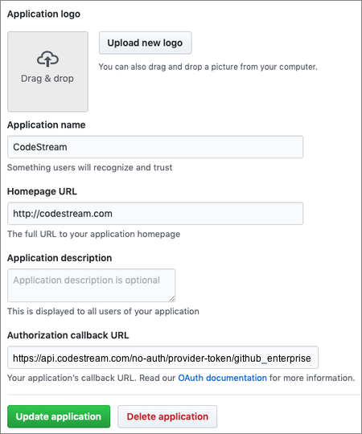

**NOTE: This integration currently requires that your GitHub Enterprise instance
be at a publicly accessible URL. We have a new version of the integration in the
works that leverages personal access tokens instead.**

CodeStream can integrate with GitHub Enterprise using GitHub’s published REST
API. To enable CodeStream to integrate with your GitHub Enterprise installation,
you will need to set up a CodeStream application within your installation. This
application serves as a conduit for users to authenticate against their GitHub
Enterprise account without ever having to enter their credentials in CodeStream.

GitHub Enterprise uses the OAuth standard (version 2.0) for client
authorization. To set up the application, log in to GitHub Enterprise as an
administrator and go to Settings. On the left, click “Organization settings”,
then click “OAuth Apps”. Then click the “New OAuth App” button. This allows you
to register a new application. If you're not part of a GitHub organization, you
would get here via Settings > Developer Settings > OAuth Apps > Register a new
Application.

Set the application name to “CodeStream” or whatever name works best for you to
identify the application. Set the Homepage URL to “http://codestream.com”. Set
the callback URL to
“https://api.codestream.com/no-auth/provider-token/github_enterprise”. If you
are using CodeStream On-Prem, be sure to replace the first part of that URL with
the URL to your on-prem instance.

Once you create the application, you’ll see a client ID and a client secret.  

The first user to set up the integration will need three pieces of information: 

* the URL used to access your GitHub Enterprise installation as known to your
  internal network, in the form http(s)://host:port
* the client ID associated with your CodeStream application
* the secret associated with your CodeStream application 

If all goes well, the user will be taken to a page in their browser where they
can authenticate against GitHub Enterprise, if needed, and then approve
CodeStream’s access to make API calls to GitHub Enterprise on their behalf. Once
complete, the integration with your GitHub Enterprise installation will become
available to all users on the team. Other users will NOT have to enter the URL,
client ID, and client secret; they will only need to go through the final
authentication process to authorize the application on their behalf.

