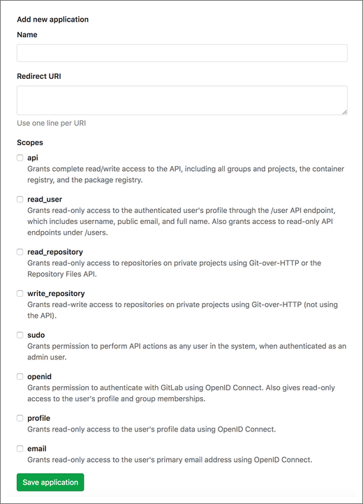

**NOTE: This integration currently requires that your GitLab Self-Managed
instance be at a publicly accessible URL. We have a new version of the
integration in the works that leverages personal access tokens instead.**

CodeStream can integrate with GitLab Self-Managed using GitLab’s published REST
API. To enable CodeStream to integrate with your GitLab Self-Managed
installation, you will need to set up a CodeStream application within your
installation. This application serves as a conduit for users to authenticate
against their GitLab account without ever having to enter their credentials in
CodeStream.

GitLab uses the OAuth standard (version 2.0) for client authorization. To set up
the application, log in to GitLab  as an administrator and go to Settings. On
the left, click “Applications”. This should take you to a page where you can set
up a new application.

Set the application name to “CodeStream” or whatever name works best for you to
identify the application. Enter
“https://api.codestream.com/no-auth/provider-token/gitlab_enterprise” for the
redirect URI. If you are using CodeStream On-Prem, be sure to replace the first
part of that URL with the URL to your on-prem instance.

Select "api" for scopes. Then click "Save application".

Once you create the application, you’ll see an application ID and a secret.

The first user to set up the integration will need three pieces of information: 

* the URL used to access your GitLab Self-Managed installation as known to your
  internal network, in the form http(s)://host:port
* the application ID associated with your CodeStream application, which they'll
  use when asked for the client ID
* the secret associated with your CodeStream application, which they'll use when
  asked for the client secret

If all goes well, the user will be taken to a page in their browser where they
can authenticate against GitLab, if needed, and then approve CodeStream’s access
to make API calls to GitLab Enterprise on their behalf. Once complete, the
integration with your GitLab Self-Managed installation will become available to
all users on the team. Other users will NOT have to enter the URL, client ID,
and client secret; they will only need to go through the final authentication
process to authorize the application on their behalf.

