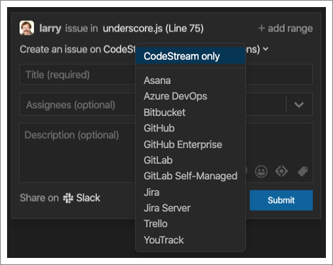

With the ability to comment on any line of code in your codebase, and not just
code that has recently been changed, CodeStream represents a lightweight form of
continuous code review. See some problematic code? Just select it and create an
issue!

If your team uses Jira (cloud or Server), Azure DevOps, Trello, Asana, GitHub
(cloud or Enterprise), Bitbucket (cloud), GitLab (cloud or Self-Managed) or YouTrack for
tracking issues, you can create an issue on one of those services directly from
CodeStream. Just select the service you use from the dropdown at the top of the
CodeMark form.

After going through the authentication process with the selected service you'll
now be able to select a  destination for your issue. For example, with Jira
you'll be able to select the appropriate issue type and project.

Once the codemark has been created it will be linked to code to which it refers.

Clicking on the codemark displays the issue details, which include a link to the
issue created on the external service. In the example below you'll see the URL
for the issue on Jira.

