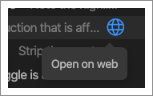
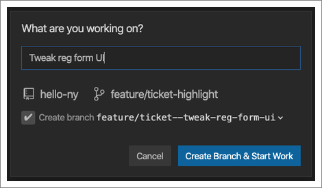

Once you’ve connected CodeStream to your team’s issue tracking service,
everything assigned to you will be listed here.

Note that you can be connected to multiple services at once, simply by selecting
them from the dropdown list.

Click the Search button to search the list by keyword, and for many services you
can also filter the list. For example, if you’re connected to Trello, you can
filter to see a specific list or set of lists. For Jira and GitHub, you can even
create custom queries.

Click on the refresh button to update the list with any recently added tickets.
Click on the globe icon that appears at the end of each row on hover to view a
ticket on the appropriate issue tracking service.

Or just click on a ticket to [start work](../workflow/start-work) by creating a
feature branch, updating the ticket status, and even updating your status on
Slack.

If you need to work on something that doesn’t have an associated ticket, you can
either click “Ad-hoc Work” to get started without a ticket.

Or, click “New Card" (although it may be labelled differently based on the
selected service) to create a ticket in your issue tracking service right from
CodeStream. You can even associate that ticket with a block of code in your
editor!

