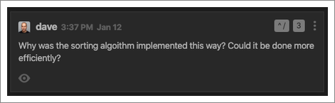

## Creating Codemarks

Keyboard shortcuts allow you to easily create codemarks without taking your
hands away from the keyboard.

Action|Windows/Linux|macOS
-------------|-------|---
Toggle CodeStream Pane|`ctrl+shift+/` `ctrl+shift+/`|`ctrl+/` `ctrl+/`
Request Code Review|`ctrl+shift+/` `r`|`ctrl+/` `r`
Next File in Review|`alt+F6`|`option+F6`
Previous File in Review|`shift+alt+F6`|`shift+option+F6`
New Comment|`ctrl+shift+/` `c`|`ctrl+/` `c`
New Issue|`ctrl+shift+/` `i`|`ctrl+/` `i`
Get Permalink|`ctrl+shift+/` `p`|`ctrl+/` `p`
Copy Permalink to Clipboard|`ctrl+shift+/` `shift+p`|`ctrl+/` `shift+p`

## Jumping to a Codemark

In addition to the shortcuts above for creating codemarks, you can also set a
shortcut for any individual codemark by selecting "Set Keybinding" from the
ellipses menu at the top-right of the codemark.

