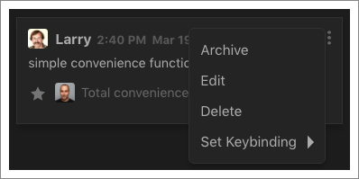
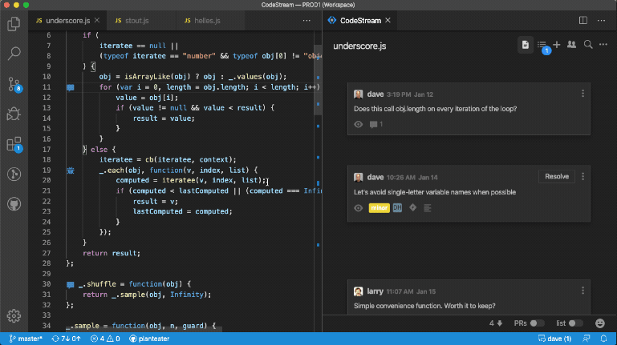
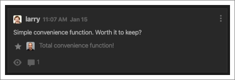
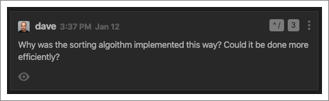
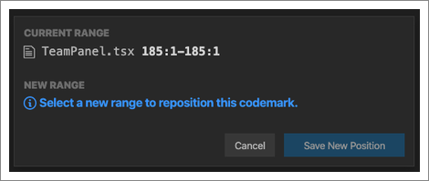
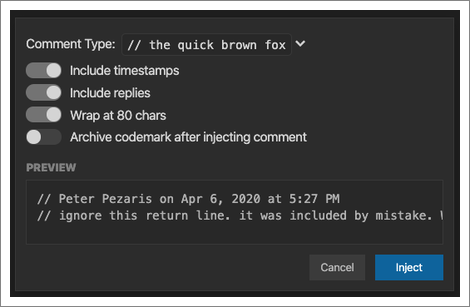

## Editing & Deleting

Click the ellipses menu at the top-right of any codemark you authored to either
edit or delete it. Note that in most cases it might make sense to archive (see
below) a codemark instead of deleting it, so that the codemark can still provide
some value down the road.

## Archiving & Resolving

If there’s a codemark that you don’t think is important enough to be on
permanent display in a given file, but you don’t want to completely delete it,
you can archive it instead. This will collapse it at the right side of the
CodeStream pane, where you can easily click to expand it again. Similarly, when
you mark an issue as resolved it’s collapsed as well.

Click on the “archived” filter in the toolbar at the bottom to quickly display
all archived codemarks and closed issues.

## Starred Replies

Some codemarks may warrant just a quick reply or two, while others may result in
lengthy discussions among the team. If there’s a specific reply in the thread
that represents “the answer”, star it so that it is displayed along with the
codemark. Someone else looking at this codemark down the road won’t need to go
hunting for the most relevant information.

## Keyboard Shortcuts

In addition to the shortcuts above for creating codemarks, you can also set a
shortcut for any individual codemark by selecting "Set Keybinding" from the
ellipses menu at the top-right of the codemark. 

## Reposition Codemark

In most cases, a codemark will automatically remain linked to the block of code
it refers to as the file changes over time. For example, if you cut the block of
code and paste it at a different location in the file, the codemark will move
right along with it. There are some scenarios, however, that CodeStream isn't
able to handle automatically. For example, if you pasted the block of code into
a different file. In these cases, Reposition Codemark allows you to select the
new location of the block of code so that the codemark is displayed properly.

## Inject as Comment

If you'd like a specific codemark to become part of the repo you can Inject as
Comment to have it added inline. Select the appropriate format, and then
indicate if you want to include timestamps, replies, or to have the comment
wrapped at 80 characters. You can also elect to have the codemark archived once
it's been added as an inline comment.

