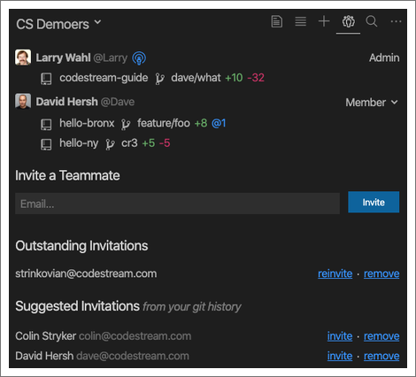
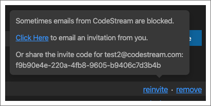
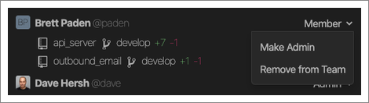
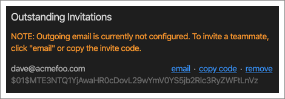
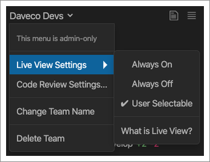
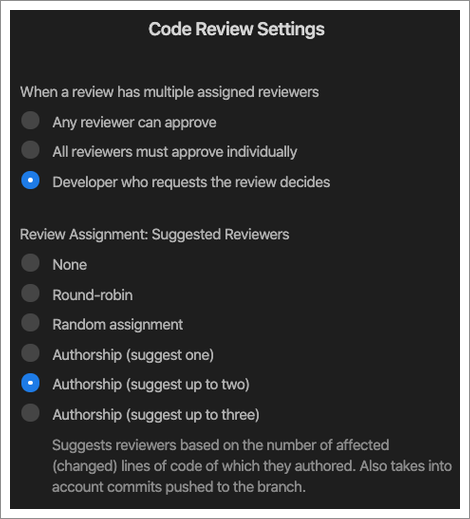

The Team tab allows anyone on the team to invite additional teammates, and
allows admins to manage the team’s members and settings. You’ll also see a [Live
View](team-live-view) of what your teammates are working on.

## Managing People & Roles

You can invite people by entering their email address and, if you're an admin,
you'll also see a list of suggested teammates based on the people that have
committed to the repos you currently have open.

Occassionally CodeStream invitations can end up in spam folders or be blocked by
some corporate email systems. If the emails aren't getting through, just hover
over the "reinvite" link, copy the invitation code, and email/message it to the
given person on your own.

Admins can also assign/remove admin privileges or remove people from the team.

For CodeStream On-Prem installations where outbound email hasn't been
configured, when you invite someone CodeStream will provide you with the
invitation code that you can then email/message to the person on your own.

## Team Settings

If you are a team admin, the team name on the Team tab will be a dropdown
exposing some team settings. In addition to changing the team’s name, you can
also determine how Live View is used by your team. It can be on for everyone,
off for everyone, or up to each individual team member to decide.

## Code Review Assignment & Approval

On the Team tab, click on the team name and select "Code Review Settings" to
control how both code review assignments and code review approvals work for your
team. 

By default, the person requesting a review can decide how approvals work, but
you can, instead, set a default behavior for all code reviews for the team. 

* Any reviewer can approve - Any one can approve the review, regardless of how
  many reviewers are assigned.
* All reviewers must approve individually - Each assigned reviewer must
  individually approve the review before it’s considered approved.

When a review is requested, you can decide if and how CodeStream suggests
reviewers. Round-robin will cycle through all developers on the team. Random
will randomly assign the review to any developer on the team. The Authorship
options will suggest up to three reviewers based on the developers who wrote the
lines of code impacted by the changes, as well as other developers who may have
committed to the branch.
