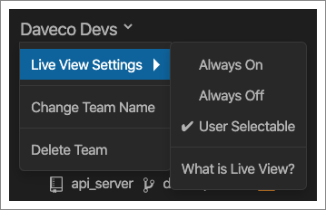

The Team tab allows anyone on the team to invite additional teammates, and
allows admins to manage the team’s settings. You’ll also see a [Live View](team-live-view) of
what your teammates are working on.

## Inviting People

You can invite people by entering their email address and, if you're an admin, you'll also see a list of suggested teammates based on the people that have committed to the repos you currently have open.

Occassionally CodeStream invitations can end up in spam folders or be blocked by some corporate email systems. If the emails aren't getting through, just hover over the "reinvite" link, copy the invitation code, and email/message it to the given person on your own.

## Team Admin & Settings

If you're a team admin you can also assign/remove admin privileges or remove people from the team.

If you are a team admin, the team name on the Team tab will be a dropdown
exposing some team settings. In addition to changing the team’s name, you can
also determine how Live View is used by your team. It can be on for everyone,
off for everyone, or up to each individual team member to decide.

