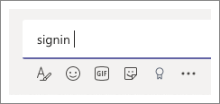
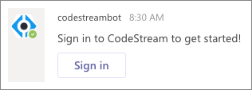
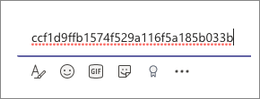
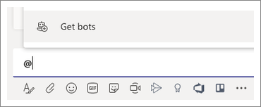
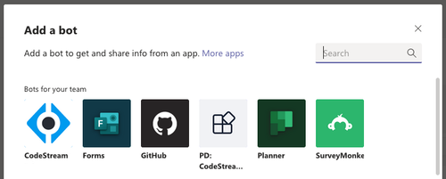
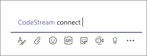

When you post a codemark your teammates will get notified via the activity feed,
and potentially via email. Sometimes, though, you might want to share the
codemark out to Microsoft Teams as well. This would allow you to reach people
who haven’t yet joined CodeStream, or maybe don’t spend a lot of time in their
IDE. 

## Connecting to Microsoft Teams

1. [Click here to install the CodeStream
   app](https://teams.microsoft.com/l/app/7cf49ab7-8b65-4407-b494-f02b525eef2b?source=store-copy-link)
   or go to "Apps" in your Teams sidebar and search for CodeStream.

1. Once installed you should see the following popup for the CodeStream app,
   click on the Add button. Note, do not expand it and select the options to add
   to team or chat. Simply click Add.

	

1. This will take you to your private chat with the CodeStream bot, and you’ll
   see the CodeStream logo appear in the Teams sidebar. Type `signin` in this
   chat and submit.

	

1. A post from the bot will appear in the stream, along with a “Sign in” button.

	

1. Click the button and you’ll be taken to the web and prompted to sign into
   CodeStream. 

	

1. After signing in you’ll be provided with a token that you’ll need to copy and
   paste into your chat with the CodeStream bot back in MS Teams. 

	

1. Paste the token into the chat and submit.

	

1. Go to a channel in which you’d like to share, type `@`, and then select `Get
   bots` from the popup. 

	

1. Select the CodeStream bot from the list (and search for it if you need to),
   and then click "Add".

	

1. Now return to the channel and @mention the CodeStream bot with the `connect`
   command. Repeat this in any channel that you'd like to share to.

	

1. Once you get the following confirmation, you’re ready to share to Teams from
   CodeStream.

	

1. When you return to CodeStream you'll now be able to share to the channels
   that you just connected.

	

## Participating from Microsoft Teams

When you share a codemark to Teams, not only does it notify your teammates about
the codemark, but they can use it to jump directly into their IDEs to
participate in the conversation on CodeStream.

### Open in IDE

Click “Open in IDE” to view both the code, and the codemark, right inside your
IDE. You’ll be first taken through a CodeStream web page where you’ll specify
which IDE to open, and CodeStream will remember this selection for the next time
you view a codemark from the same repo. You’ll then be taken to the appropriate
source file in your IDE, scrolled to the relevant block of code, with the
codemark displayed in the CodeStream pane to the right. If you don’t happen to
have the given repo open in your IDE, CodeStream will automatically open the
source file for you (assuming you’ve opened that repo previously, with
CodeStream installed, so that we know where to find it).

Note that if you’re using a JetBrains IDE you’ll need to first install the
[Toolbox App](https://www.jetbrains.com/toolbox-app/) so that CodeStream can
deep link into the IDE.

### Open on GitHub (or Bitbucket or GitLab)

If the code block is from a repo hosted on GitHub, Bitbucket or GitLab, this
button will take you to the corresponding block of code on that hosting service.
