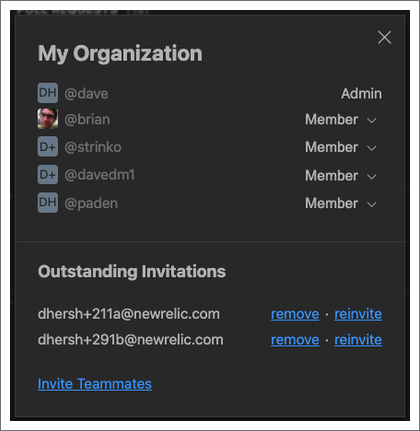
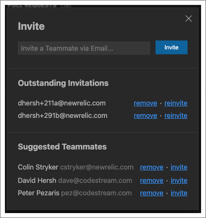

The My Organization menu allows you to see who is in your CodeStream
organization, invite new members, and create blame maps.

## My Organization

Select "My Organization" to see a list of all members of your CodeStream
organization. Admins will be identified in the list, and if you are an admin,
you'll have a dropdown to assign remove admin priviledges to any member.

## Invite Teammates

Select "Invite Teammates" to invite new members to your organization. 

The "Outstanding Invitations" section lists all open invitations, and at the
right side of each row are links to remove the invitation or to reinvite.
Clicking "reinvite" will have CodeStream send another invitation via email, but
you also have the option to generate an email yourself.

The "Suggested Teammates" section, which is only available for admins, is a list
of possible teammates derived from the commit history of your open repositories.
At the right side of each row are links to remove the suggestion from the list
or to invite the person.

## Blame Map

Select "Blame Map" to add email addresses that you use for committing code that
may be different from the email address you used to sign up for CodeStream. For
example, your CodeStream email address might be dave@acme.com, but you might
also commit code as dave@webmail.com. Click "Add mapping", enter your git email
address, and then select your entry from the list of organization members. That
way, when someone comments on code committed by dave@webmail.com, CodeStream
will know to at mention you (i.e., dave@acme.com).

While non-admins can only create blame maps for themselves, admins can create
blame maps for any member of the organization. This is useful for reassigning
code ownership when people leave the organization.