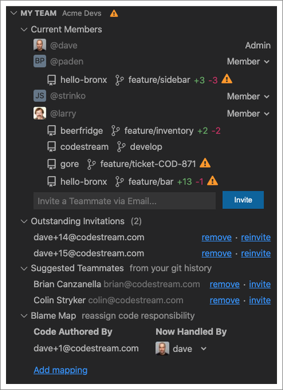
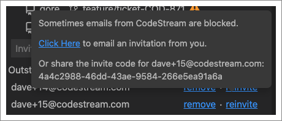
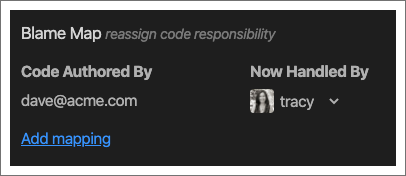
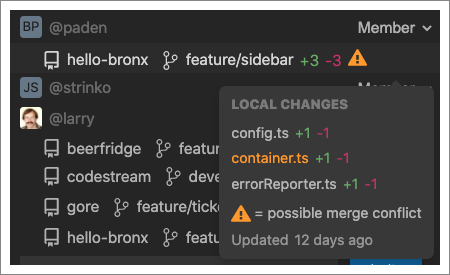
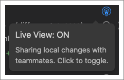

The My Team section of the CodeStream pane allows you to see who is on your
team, and to invite new members. It also gives you a "live view" into what your
teammates are working on.

The "Current Members" section lists all of the members of your CodeStream team.
Team admins will be identified in the list, and if you are an admin, you'll have
a dropdown to assign remove admin priviledges to any member.

You can invite new members by using the form at the bottom of the members list,
by clicking on the Invite icon in the heading of the My Team section.

The "Outstanding Invitations" section list all open invitations. At the right
side of each row are links to remove the invitation or to reinvite. Clicking
"reinvite" will have CodeStream send another invitation via email, but you can
also hover over that link to grab the invitation code and email/message it to
the person on your own.

For CodeStream On-Prem installations where outbound email hasn't been
configured, when you invite someone CodeStream will provide you with the
invitation code that you can then email/message to the person on your own.

The "Suggested Teammates" section, which is only available for team admins, is a
list of possible teammates derived from the commit history of your open repos.
At the right side of each row are links to remove the suggestion from the list
or to invite the person.

## Blame Map

The "Blame Map" section, which is also only available for team admins,
allows you to define code ownership on the team. By default, when you comment on
code, CodeStream mentions (or offers to email) the author(s) of the code you are
commenting on. But if that person has left the company, or transitioned to a
different role, it might not be the right thing to do.

The Blame Map allows you to direct discussions about code that the former team
member worked on to someone else on the team. Based on the mapping in the
screenshot above, the next time someone asks a question about code authored by
Dave, or requests a review of changes to that code, Tracy will be
mentioned/assigned instead of Dave.

## Live View

In addition to listing all members, the "Current Members" section also gives you
a live view into what everyone is working on. Below each teammate’s name is a
list of the repositories in which they have made local changes (i.e., changes
that haven’t been pushed). In addition to the repo name, you’ll see the branch
name, line additions/deletions, a count of the number of changes to code that
you wrote (in lines of code), and a warning if any of the changes could lead to
a merge conflict.

You can also hover over an entry to see the files that have been changed,
including ones that represent potential merge conflicts, and how recently this
info was updated. This information helps you avoid the costly effort of needing
to resolve a merge conflict at a later point by preventing it up-front.

You can opt-out of sharing by clicking on the Live View icon in the heading of
the Work In Progress section (although your team admin may have set this to
always on or always off at the team level).

