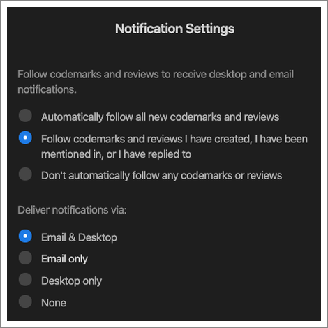

CodeStream will notify you about codemarks and code reviews that you "follow",
and you can choose whether you want to be notified via email, desktop (for the
VS Code and JetBrains extensions only), or both.

By default, you are set to automatically follow any codemark or code review that
you created, any codemark or code review where you’ve been mentioned (either in
the original post or in a subsequent reply), or any codemark or code review to
which you’ve replied. You can always elect to follow/unfollow any individual
codemark or code review via its ellipses menu.

Email notifications are sent immediately. You can participate in the discussion
by simply replying to the email. Your reply will get added to CodeStream as
reply to the appropriate codemark or code review. Be sure that when you reply
you are doing so from the same email address to which the notification was sent
(i.e., your email address on CodeStream). Also note that you can unfollow a
codemark or code review by clicking the link at the bottom of the email.

If you’re using CodeStream in VS Code or a JetBrains IDE you’ll also receive
desktop notifications in the IDE for codemarks that you follow.

Clicking on the Open button will open the codemark/code review so that you can
participate in the discussion.
