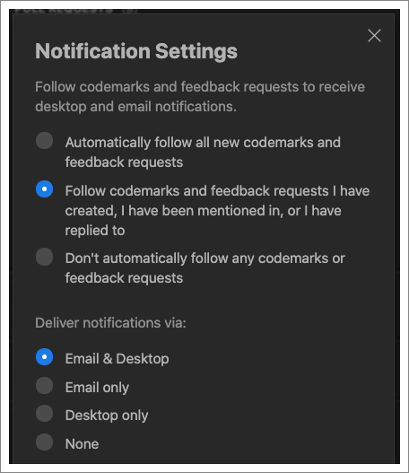
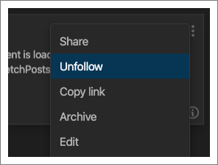
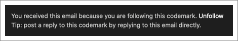
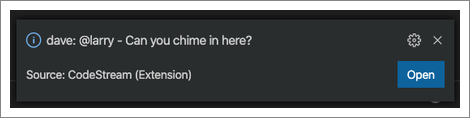
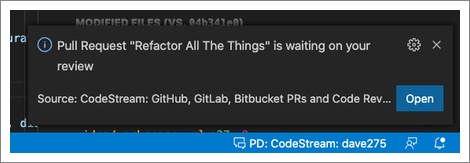

CodeStream will notify you about comments, issues and feedback requests that you
"follow", and you can choose whether you want to be notified via email, desktop
(for the VS Code and JetBrains extensions only), or both. Look for the
Notifications option under the headshot menu at the top of the CodeStream pane.

By default, you are set to automatically follow any comment, issue or feedback
request that you created, where you’ve been mentioned (either in the original
post or in a subsequent reply), or to which you’ve replied. You can always elect
to follow/unfollow any individual comment, issue or feedback request via its
ellipses menu.

Email notifications are sent immediately. You can participate in the discussion
by simply replying to the email. Your reply will get added to CodeStream as
reply to the appropriate comment, issue or feedback request. Be sure that when
you reply you are doing so from the same email address to which the notification
was sent (i.e., your email address on CodeStream). Also note that you can
unfollow a codemark or code review by clicking the link at the bottom of the
email.

If you’re using CodeStream in VS Code or a JetBrains IDE you’ll also receive
desktop notifications in the IDE for comment, issue or feedback request that you
follow.

Clicking on the Open button will open the discussion so that you can
participate.

If you've connected to GitHub or GitHub Enterprise to leverage CodeStream's [pull request integration](../workflow/pull-requests) you'll also be notified when a pull request is assigned to you or you are added as a reviewer.

Clicking on the Open button will open the pull request right in your IDE where you can review the changes.
