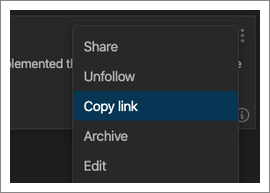
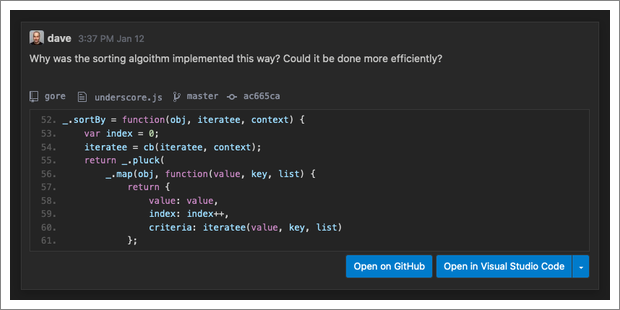
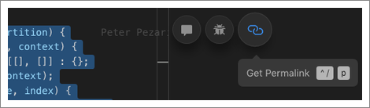
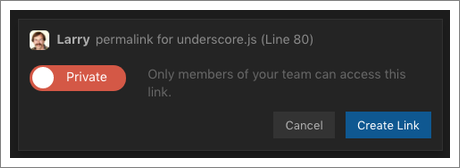
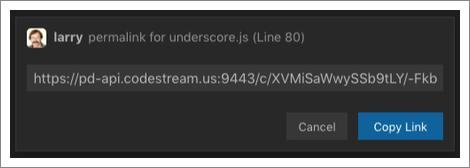
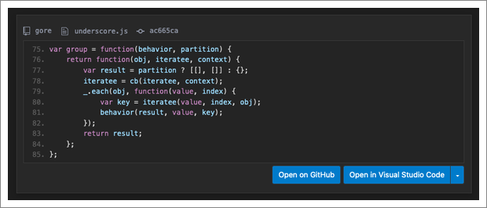

## Permalinks for Codemarks

CodeStream has built-in mechanisms for sharing codemarks to Slack or
issue-tracking services, like Jira, Trello, etc., but you can also grab the link
for any individual codemark to share it elsewhere. An existing Jira ticket. A
wiki. A thread in your messaging service. Whatever the case may be, just look
for the “Copy link” option under the codemark’s ellipses menu.

Whenever someone clicks on the link, after authenticating with CodeStream
they'll be brought to a web page rendering the codemark. From there you can open
the code in your IDE, or on GitHub/Bitbucket/GitLab.

## Permalinks for Code Blocks

Sometimes you don’t necessarily want to comment on a block of code, but instead
just want to easily share the code with a teammate. CodeStream's permalinks are
"living" links that will always point to the code in question, even if it's
moved to a different location in the file.

Select the code in your editor and then click the button to get a permalink for
that code.

Decide whether you want the permalink to be public or private, with private
permalinks requiring CodeStream authentication before the code can be viewed.

Copy your permalink and paste anywhere you'd like to share the block of code.

Whenever someone clicks on the permalink, they'll be brought to a web page
rendering the code block. From there you can open the code in your IDE, or on
GitHub/Bitbucket/GitLab.

