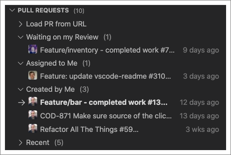
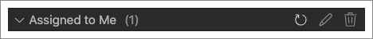
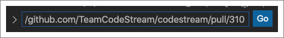
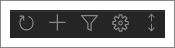
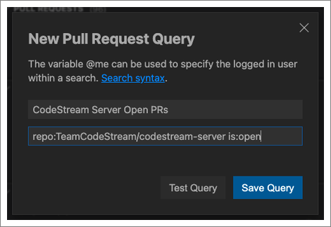
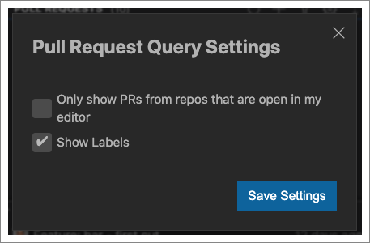

**NOTE: The Pull Requests section currently only supports GitHub and GitHub
Enterprise. Unless you're already connected to one of those services, the
section will only appear if you have a repository from one these services open
in your IDE.**

The Pull Requests section of the CodeStream pane lists all open pull requests
that are relevant to you, and gives you the ability to control the list via
custom queries. 

By default, you'll see your pull requests broken out into the following
sections, which are really just default queries.

* Waiting on My Review - Open pull requests where you are a reviewer, or a
  requested reviewer.
* Assigned to Me - Open pull requests assigned to you.
* Created by Me - Open pull requests created by you.
* Recent - The five most recent pull requests created by you, regardless of
  status.

Click on any pull request in the list to [edit, review or even merge the
code](../workflow/pull-requests). When you hover over a pull request's row
you'll see more details, including the repo, branches and status. You'll also
see an option to view the pull request on your code-hosting service toward the
end of the row. 

Hover over any section's heading for options to refresh the list, edit the
section's query, or to delete the section.

The first section actually allows you to load any pull request via URL. Just
grab the URL of any pull request, paste it in, and you can view it right inside
CodeStream.

When you hover over the Pull Requests section heading, icons appear at the
right.

Options there include the ability to refresh all the sections (i.e., queries) at
once, create a new pull request, and to create a new section based on a custom
query. 

Click on the gear icon for more options, including the ability to see pull
requests from all repositories, and not just those associated with repositories
open in your IDE, and the ability to include labels in the list.

