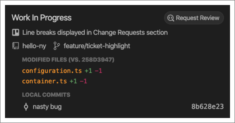

The new “Tasks” tab gives you quick access to everything on your plate. Open
code reviews. Work in progress in your IDE. And the backlog of tickets assigned
to you in your issue tracker.  All accessible, and actionable, right from your
IDE.

## Open Reviews

The Open Review section lists all open code reviews that have been assigned to
you, and all open code reviews that you have requested. Click on a review to
jump in and start reviewing, or to see your teammate’s comments on your work.

## Work In Progress

The Work In Progress section is a snapshot of the local changes you have in
flight in your IDE, as well as the associated ticket from your issue tracking
service. Click on any file name to view a diff of your changes so far, and look
out for the file names in orange as they represent potential merge conflicts.
Hover over the file name to see which teammate you need to coordinate with to
avoid a conflict.

Most importantly, click Request Review when you’re ready to have someone look at
your changes. Remember that you don’t need to wait until the work is completed
to get a review. Earlier reviews result in less rework and better code quality.
Reviews of work-in-progress code, including uncommitted code, are frictionless
for both you and the person doing the review.

## What are you working on?

Once you’ve connected CodeStream to your team’s issue tracking service,
everything assigned to you will be listed here.

Note that you can be connected to multiple services at once, simply by selecting
them from the dropdown list.

Click the Search button to search the list by keyword, and for many services you
can also filter the list. For example, if you’re connected to Trello, you can
filter to see a specific list or set of lists.

Click on the refresh button to update the list with any recently added tickets.
Click on the globe icon that appears at the end of each row on hover to view a
ticket on the appropriate issue tracking service.

Or just click on a ticket to [start work](../workflow/start-work) by creating a
feature branch, updating the ticket status, and even updating your status on
Slack.

If you need to work on something that doesn’t have an associated ticket, you can
either click “Ad-hoc Work” to get started without a ticket.

Or, click “New Card" (although it may be labelled differently based on the
selected service) to create a ticket in your issue tracking service right from
CodeStream. You can even associate that ticket with a block of code in your
editor!

