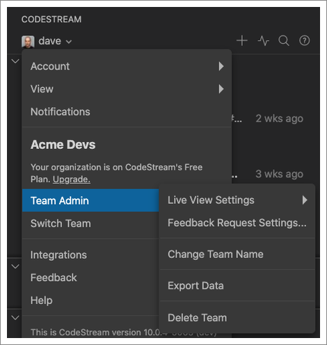

## Managing People & Roles

The [My Team section](myteam-section) of the CodeStream pane allows you to
invite people via email address, and allows team admins to assign and remove
admin privileges.

The "Blame Map" section allows you to define code ownership on the team. By
default, when you comment on code, CodeStream mentions (or offers to email) the
author(s) of the code you are commenting on. But if that person has left the
company, or transitioned to a different role, it might not be the right thing to
do.

The Blame Map allows you to direct discussions about code that the former team
member worked on to someone else on the team. Based on the mapping in the
screenshot above, the next time someone asks a question about code authored by
Dave, or requests a review of changes to that code, Tracy will be
mentioned/assigned instead of Dave.

## Team Settings

If you are a team admin, look for the Team Admin menu under the headshot menu at the top of the CodeStream pane.

## Live View Settings

[Live View](myteam-section/#live-view) gives your team visibility into what everone is working on. By
default, each team member can determine whether or not they want to share what
they're working, but as an admin you can also force Live View on or off for
everyone.

## Feedback Request Assignment & Approval

Team admins can control how both feedback request assignments and approvals work
for the team. 

By default, the person requesting feedback can decide how approvals work, but
you can, instead, set a default behavior for all feedback requests for the team.

* Any reviewer can approve - Any one can approve the feedback request,
  regardless of how many reviewers are assigned.
* All reviewers must approve individually - Each assigned reviewer must
  individually approve the feedback request before it’s considered approved.

You can also decide if and how CodeStream suggests reviewers. Round-robin will
cycle through all developers on the team. Random will randomly assign the
feedback request to any developer on the team. The Authorship options will
suggest up to three reviewers based on the developers who wrote the lines of
code impacted by the changes, as well as other developers who may have committed
to the branch.

## Change Team Name

Update the name of your CodeStream team at any time.

## Data Export 

A lightweight export facility for getting your team's discussions out of
CodeStream. Click the icon to copy all of the data to the clipboard.

