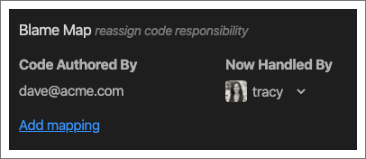

## Managing People & Roles FIXME

The [My Team section](myteam-section) of the CodeStream pane allows you to
invite people via email address, and allows team admins to assign and remove
admin privileges.

The "Blame Map" section allows you to define code ownership on the team. By
default, when you comment on code, CodeStream mentions (or offers to email) the
author(s) of the code you are commenting on. But if that person has left the
company, or transitioned to a different role, it might not be the right thing to
do.

The Blame Map allows you to direct discussions about code that the former team
member worked on to someone else on the team. Based on the mapping in the
screenshot above, the next time someone asks a question about code authored by
Dave, or requests a review of changes to that code, Tracy will be
mentioned/assigned instead of Dave.

## Organization Settings

If you are an organiztion admin, look for the Organization Admin menu under the
headshot menu at the top of the CodeStream pane.

## Onboarding Settings

Domain-based joining allows anyone with email addresses on the specified domains
to join your CodeStream organization without being first invited. Not only does
this make it very easy to get your teammates on board, but it ensures that
they'll be part of your organization (as opposed to accidentally creating their
own).
FIXME

The Integration Options section allows you to smooth the onboarding process
process for your teammates by eliminating unnecessary unnecessary options, and
of the possibility of mistakes. You can control which authentication options
they can use. For example, you might want everyone to sign up using GitHub. You
can also specify your organization's preferred code host, messaging service, and
issue tracker. Note that you can select multiple services in each category.
FIXME

## Feedback Request Assignment & Approval

Admins can control how both feedback request assignments and approvals work
for the organization. 

By default, the person requesting feedback can decide how approvals work, but
you can, instead, set a default behavior for all feedback requests for the
organization.

* Any reviewer can approve - Any one can approve the feedback request,
  regardless of how many reviewers are assigned.
* All reviewers must approve individually - Each assigned reviewer must
  individually approve the feedback request before it’s considered approved.

You can also decide if and how CodeStream suggests reviewers. Round-robin will
cycle through all developers in the organization. Random will randomly assign
the feedback request to any developer in the organization. The Authorship
options will suggest up to three reviewers based on the developers who wrote the
lines of code impacted by the changes, as well as other developers who may have
committed to the branch.

## Change Organization Name

Update the name of your CodeStream organization at any time.

## Data Export 

A lightweight export facility for getting your organization's discussions out of
CodeStream. Click the icon to copy all of the data to the clipboard.

