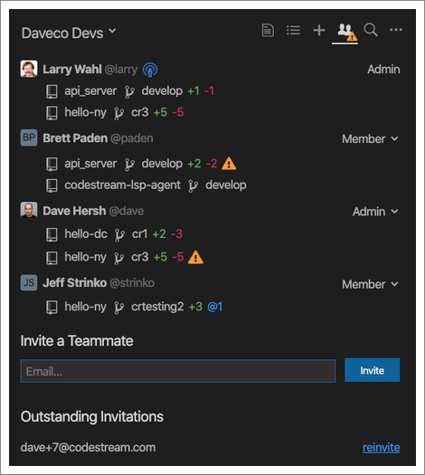
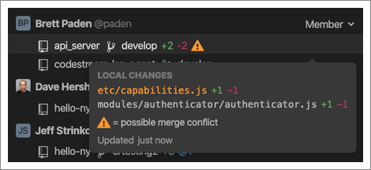
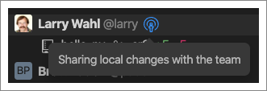
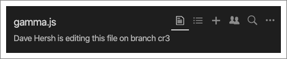
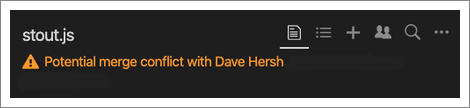

Development is a collaborative activity, yet much of it happens in isolation,
with work only shared with the team at the end of a cycle, or sprint.
CodeStream’s “Live View” increases transparency by making the local edits of
individual developers visible to team members, so that everyone knows what
everyone else is working on, in real-time.

As developers write code, whether editing existing files or creating new files,
a summary of their changes, including the repo(s), files, and lines changed is
exposed to their teammates through CodeStream. The information is displayed
contextually, in the IDE, and even warns teammates of potential merge conflicts…
before they happen!

### Team Tab

In addition to allowing you to see who is on your team, and to invite new
members, the Team tab also gives you a live view into what everyone is working
on. Below each teammate’s name is a list of the repositories in which they have made
local changes (i.e., changes that haven’t been pushed). In addition to the repo
name, you’ll see the branch name, line additions/deletions, a count of the
number of changes to code that you wrote (in lines of code), and a warning if
any of the changes could lead to a merge conflict.

You can also hover over an entry to see the files that have been changed,
including ones that represent potential merge conflicts, and how recently this
info was updated.

Your entry on the Team tab is always displayed first, and you can opt-out of
sharing by clicking on the icon to the right (although your team admin may have
set this to always on or always off at the team level).

 
### Current File

CodeStream also surfaces this information on the Current File tab, so that
you’re immediately aware of when other developers are working in the same files
as you. If another developer has the same file open in their IDE and has made
changes, you’ll see the following message.
 

If both you and the other developer have made changes to the file, you’ll see
the following message.

