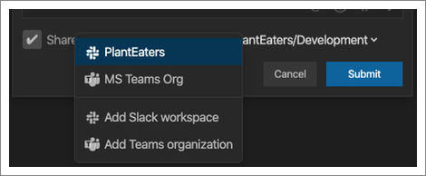

Just like Twitter has Tweets, CodeStream uses **Codemarks** as a unit of
conversation.

## What is a codemark?

Quite simply, a codemark is a discussion connected to the code. It could be a
question, a suggestion, a bug report, documentation, or even an informal code
review. All of these discussions are saved, anchored to the blocks of code they
refer to, so that they can be leveraged in the future. It could be a new
developer joining the team, a developer trying to fix a bug in someone else’s
code, or even just you trying to remember why you made that change six months
ago… whatever the case, CodeStream helps you understand the code by surfacing
the discussions in a contextual way.

Even as a file changes over time, the codemarks will remain connected to the
code. Add some new lines of code above the code block, make edits to the code,
or even cut-and-paste the entire block to a different section of the file, and
you’ll see the codemark move right along with the changes.

## Creating a codemark

Create a codemark by selecting a block of code in your editor and then clicking
on one of the icons that appears to the right of your selection in the
CodeStream pane. CodeStream will even automatically mention the teammate that
most recently touched that code (although you can, of course, mention any
teammate).

You can also use the CodeStream options in either the lightbulb or context
menus, which are always available... even when the CodeStream pane is closed.

Need to reach teammates that don’t spend a lot of time in the IDE? Or maybe some
teammates that aren’t yet on CodeStream? You can optionally share a codemark out
to Slack or Microsoft Teams. The Slack integration even allows your teammates to
reply directly from Slack.

### Comment Codemarks

The all-purpose codemark for linking any type of discussion to a block of code.
Ask a question. Make a suggestion. Document some code. Make note of key sections
of the codebase. The possibilities are endless!

### Issue Codemarks

When something needs to get done there’s always a better chance of it happening
if it’s captured as an issue, with someone’s name attached. Assign issues as a
way of providing informal code review. Or manage your tech debt by capturing
items as tracked issues instead of inline FIXMEs. 

CodeStream integrates with issue-tracking services such as Jira, Trello, GitHub,
and others so you can create an issue on one of those services directly from
CodeStream. Learn more about [CodeStream's issue-tracking
integrations](../features/issue-tracking-integrations).

## Different versions of the code?

Maybe you’re on a feature branch, have local changes, or simply haven’t pulled
in a while. There are countless reasons why the code you’re looking at might be
different than what a teammate is looking at, and as a result, there will be
plenty of times when the code referenced in a codemark doesn’t match what you
have locally.

CodeStream recognizes these situations and gives you the ability to view the
code block as a diff against your version of the code (see “Compare” button), or
you can use the “Apply” button to apply the code block in your editor.

Keep in mind that with CodeStream you can discuss any line of code, in any
source file, at any time, even if it’s code that you just typed into your editor
and haven’t yet saved or committed. Discussing code early and often, even code
fresh off of your fingertips, can take a lot of the pain out of your code
reviews/pull requests. CodeStream makes this possible by allowing you to get
feedback from your teammates without having to go through a formal process. 

## How are codemarks discovered?

Your teammates will get notified about new codemarks via the [activity
feed](../features/activity-feed), and potentially via [email and desktop
notifications](../features/notifications), or sharing on
[Slack](../features/slack-integration) or [Microsoft
Teams](../features/msteams-integration). CodeStream also makes sure the right
developer sees past discussions at the right time by displaying them right
alongside the blocks of code they refer to.

Seeing codemarks related to the files you’re working on is how you’ll leverage
your team’s knowledge base on an ongoing basis. Note the icons in the special
gutter at the left side of the editor. These allow you to know where discussions
about code took place, even when the CodeStream pane is closed. Just click to
view the discussion.