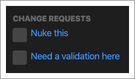

_**CodeStream’s code review functionality is currently in BETA only available in
our extensions for VS Code and JetBrains.**_

Traditional code review happens at the end of the development cycle, when you’re
looking to get the changes merged. Not only are end-of-cycle code reviews much
more burdensome on your teammates, but you also run the risk of identifying
issues so late in the game that you end up having to decide between blowing up
your schedule or taking on technical debt.

CodeStream’s code reviews take all of the friction out of both requesting a
review and performing a review, with the hope that you’ll do them frequently
during the course of the development cycle.

Request a code review at any point during the development cycle, whether you’d
like feedback on stubbed out functions, mid-way through a work in progress, or a
final review of a finished project. Requesting a review happens in the IDE, with
one command, and CodeStream handles the complexity of sharing your current
status including pushed commits, local commits, staged and saved changes. Code
reviews are also performed in the IDE and do not require switching branches, or
pulling changes.

CodeStream code reviews are simpler because they can be initiated with one
command, and don’t require that code be committed and pushed. They are more
powerful because you can review code in any state: whether finished or still a
WIP. And they are easier to perform because they don’t require a mix of
different tools (email, web browser and IDE), and give you access to your
favorite keybindings and commands in your editor.

By the time you get to that formal code review/pull request at the end of the
development cycle, it’s far less painful and more of a formality because issues
have been raised, discussed and resolved all along the way. [Learn more about
shift-left code
reviews.](https://www.codestream.com/blog/reviewing-the-code-review-part-i)

## Requesting a Review
Request a review at any time, regardless of the current state of your work, by
selecting “Request a Code Review” from the “+” menu in the CodeStream global
navigation or by using a keyboard shortcut (`ctlr+shift+/` `r`, or `ctrl+/` `r`
on a Mac).

CodeStream assumes that you are requesting a review based on the repo/branch of
the file currently selected in your editor. If you have multiple repositories
open in your IDE at the same time, you can change this via the repo dropdown at
the very top of the form. The review title defaults to the name of the branch,
and up to two reviewers may be set based on whose code you’re “stomping on” the
most with this set of changes (or other developers that have also committed to
this branch). Hover of a reviewer’s name to see more details, or click on the
name to remove them.

The Changed Files section lists all of the files that have been added, removed
or modified. You can even click on any file to view a diff just as the assigned
reviewer(s) will see it.

If you have a file that’s not suitable for code review, such as a checked-in
binary file, you can hover over any file and click the X to exclude that file
from the review. That file will be moved to a list below the review form. Note
that new files are, by default, excluded from the review, but you can hover over
their entry in the list and click "+" to add them into the review.

Hover over an excluded file and click on the trashcan to permanently exclude it
from all future reviews. Permanently excluding files creates a .codestreamignore
file in the repository. If you think your teammates will also want to exclude
these files (e.g., a package-lock.json or other system-generated file), you can
commit and push the file so that they can make use of it as well.

The changes represented across the selected files are broken out into four
different categories, allowing you to select exactly what you would like to
include in the review:

* Saved Changes
* Staged Changes
* Local Commits
* Pushed Commits

Unlike any other code review services, CodeStream allows you to have uncommitted
code reviewed by a teammate, with no need to commit, push or issue a PR.

Note that commits are listed in descending order across the Local Commits and
Pushed Commits sections, and unchecking the box for a commit will automatically
uncheck the boxes for all preceding commits. In other words, the commits
included in the review must be consecutive. Only your commits are checked by
default, but if you can include any of them in your review. (Tip: Make sure the
email address in your git configuration matches your CodeStream email address.)

Lastly, you can optionally share the code review out to either Slack or MS Teams.

## Discovery / Notifications
When you submit your code review, teammates will be notified via the activity
feed, with anyone assigned as a reviewer being @mentioned so that they’ll also
receive an email notification. 

As with codemarks, notifications for code reviews are based on whether or not
you follow the review. By default you automatically follow code reviews that you
have created, where you are a reviewer or have been mentioned, or that you have
replied to. You can follow/unfollow individual reviews via the review’s ellipses
menu, or by clicking the unfollow link in an email notification.

Teammates may also be notified via Slack or MS Teams if you elected to share to
either of those messaging platforms. The Slack integration also allows your
teammates to reply to the review directly from Slack.

If you want to get an overview of all of the team’s code review activity, head
over to the Filter & Search tab. By default, any open code reviewers where you
are an assigned reviewer will be displayed in an “Open & Assigned to Me”
section.

There are some additional filters related to code reviews:

* All Open Issues and Code Reviews - Everything the team has outstanding.
* Your Code Reviews - All code reviews you have requested.
* Everything impacting code you wrote - All code reviews that include changes to code that you wrote.
* Custom filters - Use [advanced search syntax](../features/filter-and-search)
  to create, and optionally save, your own filters based on review status,
  author, assignee, etc.

## Performing a Review
As if being able to request a code review right from inside your IDE wasn’t
awesome enough, your teammates can do the actual review from their IDEs as well!
And there’s no need for your teammates to switch branches or pull changes. As
long as they have the appropriate repo open in the IDE, they can simply click on
the review, from either the activity feed or the filter & search tab, and start
reviewing the changes.

Click on any file in the Changed Files section to review the changes. You’ll be
presented with a diff in your editor, and you can step through the changes in
the file using the up and down arrows provided by your IDE at the top of the
editor.

Typically, the diff will represent the changes in the branch associated with the
review (i.e., usually a feature/topic branch) against the base branch, at the
point at which the feature branch was created. Note that with CodeStream diffs
this may not always be the case since the author of the review may not have
included all of their changes in the review. As a result, the version of the
files that the changes are being diff’ed against may, in fact, also include
changes that aren’t in the base branch. This is important in order to provide
continuity.

### Comments & Change Requests
If you have a general comment about the review / changes, just add a reply to
the review’s thread.

But if you want to comment on the actual changes, just hover up and down the
gutter at the left side of the CodeStream pane and then click on the comment
button that appears to the right. You can also select a block of code from the
right side of the diff, and then either click on the comment button or use a
keyboard shortcut (`ctlr+shift+/` `c`, or `ctrl+/` `c` on a Mac).

Since you have the full file context when doing a review, you aren’t limited to
commenting on just the lines of code that changed. For example, you might notice
another part of the file that needs work as well, or that you simply want to
reference.

Whether it’s a general comment or a comment on code, you can mark it a “change
request” to let the author know that it’s required before you’ll approve the
changes. 

While you are performing a review, you can even comment on files that are not
part of the review, and they will get added as a reply to the review. This is
helpful to be able to point your teammate to another location in the codebase
that might have a hint of a better way to do something.

All of the change requests associated with the review are summarized in a
section at the top of the review, in addition to being part of the review’s
discussion thread. This is where they will get marked complete when the work is
done.

Look for the green and red buttons at the top of the review to either approve or
reject it, and click Exit to leave the review. Note that, for the moment, you’ll
need to separately close the diff view as well.

## Does it connect to a pull request?
At the moment, there’s no formal connection between CodeStream code reviews and
your PR process. CodeStream reviews aren’t meant to replace your PR, but our
hope is that you’ll use them leading up to your PR and that the formal code
review you do at the end of the cycle via your version-control service becomes
more of a quick formality because the code has already been discussed and
reviewed on CodeStream.

We do envision a connection to the PR process as a next step in the development
of CodeStream code reviews. For example, being able to push information about
CodeStream reviews for the given branch up into a PR, or even being able to
create the PR from CodeStream. In the meantime, you can grab the permalink for a
review using the “Copy link” option from its ellipses menu and add that to your
PR for reference.
