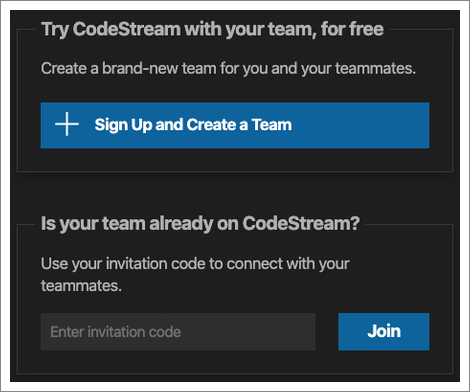
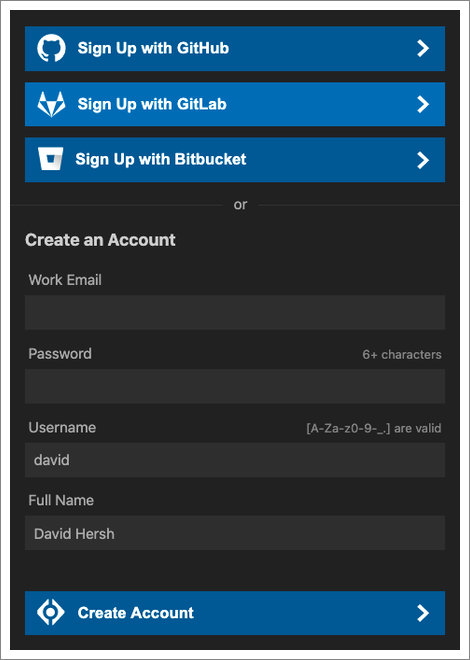
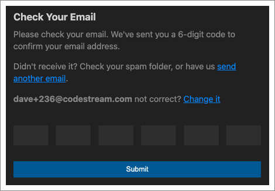
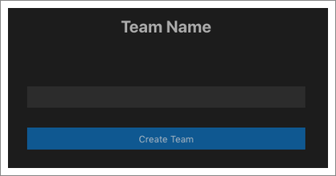
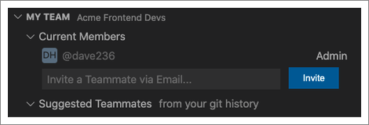

A “team” on CodeStream is where you and your teammates will discuss code. It’s
possible that some organizations will have [multiple teams on
CodeStream](../faq/need-teams), and developers can be on more than one team, but
if none of your immediate teammates are yet on CodeStream then it’s up to you to
sign up and create a CodeStream team! If you think your team is already on
CodeStream, learn about how to [join an existing team](join-a-team).

## Sign up

If you already have the CodeStream extension [installed in your
IDE](install-codestream), you can start the signup process from the CodeStream
pane.

Click on the "Sign Up and Create a team" button to get started.

You can sign up by either creating a set of CodeStream credentials (i.e., email
address and password), or you can sign up using GitHub, GitLab or Bitbucket
(cloud versions only).

If you sign up via CodeStream, your next step will be to confirm your email
address by entering a code sent to you via email. Note that you can paste the
code into any of the boxes rather than typing each number individually.

From there you’ll be asked to give your team a name.

Now that you’ve created a team, and are signed into CodeStream, it’s time to
invite your teammates!

## Invite your team

Looks for the My Team section at the bottom of the CodeStream pane to invite
your teammates.

You’ll see a list of people already on the team, and can invite others by email
address.
