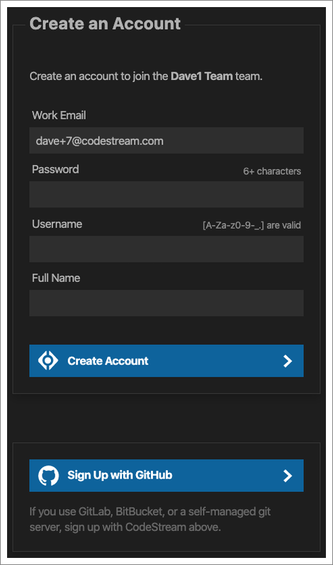
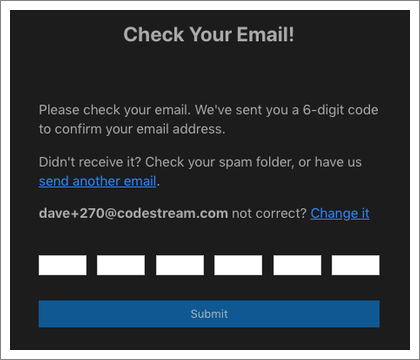

If any of your teammates are already on CodeStream you’ll want to join their
CodeStream team, and in order to do so you’ll need one of them to invite you.
Once you receive the invitation email, paste in the invitation code and then
click "Join" to get started.

Copy the invitation code from the email, paste it into the form, and then click
"Join".

You'll then be taken to CodeStream’s signup form.

You can sign up by either creating a set of CodeStream credentials (i.e., email
address and password), or you can sign up using GitHub. Note that signup via
GitHub currently works with GitHub's cloud service.

If you sign up via CodeStream, and you want to use an email address other than
the one the invitation was sent to, you can simply replace the one that was
pre-filled. If you do so, your next step will be to confirm the address by
entering a code sent to you via email. Note that you can paste the code into any
of the boxes rather than typing each number individually.

Now you're all set to start using CodeStream!
