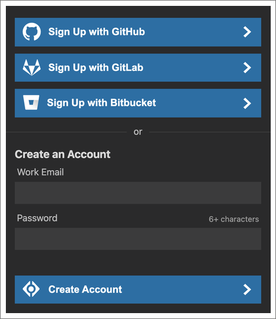
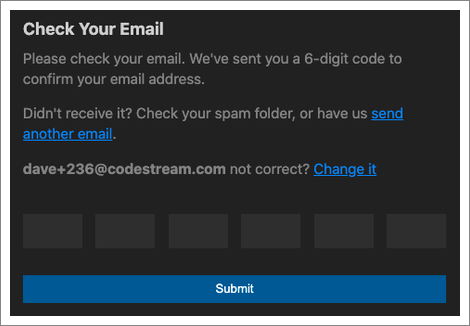
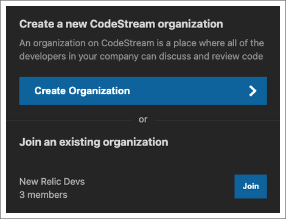
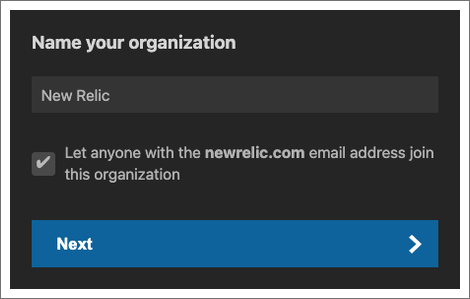

## Create an Account

If you already have the CodeStream extension [installed in your
IDE](install-codestream), you can start the signup process from the CodeStream
pane.

You can sign up by either creating a set of CodeStream credentials (i.e., email
address and password), or you can sign up using GitHub, GitLab or Bitbucket
(cloud versions only). Signing up via your code host saves you from having to
connect later, but if the email address you're using there isn't your work email
you should create CodeStream credentials instead.

If you sign up via CodeStream, your next step will be to confirm your email
address by entering a code sent to you via email. Note that you can paste the
code into any of the boxes rather than typing each number individually.

## CodeStream Organizations

An “organization” on CodeStream is where you and your teammates will discuss
code. Similar to a Slack workspace, all of the developers in your company should
be in the same CodeStream organization. This is true even for very large
organizations as CodeStream's activity feed keeps things relevant for each
member by showing just activity related to the code you have open in your IDE.
The discussions about code build up a knowledgebase that is a company-wide
resource, so the only reseaon to have mutliple organizations on CodeStream is if
you truly need separation. For example, you might have an organization for your
day job and another for an open-source project you work on. Or maybe you're a
consultant that is a member of different CodeStream organizations for each of
your clients.

## Create or join an organization

If you were invited to join an organization on CodeStream, all you need to do is
sign up using the same email address the invitation was sent to. You'll
automatically be added to that organization.

If you're the first person from your company to sign up for CodeStream you can
go ahead and create a new organization. Otherwise, there may be existing
CodeStream organizations available for you to join based on your email domain.
If you think your company is already on CodeStream, but don't see an
organization to join, make sure that you've signed up with your work email
address. Click the link to change your email address if necessary.

If you decide to create an organization you'll be asked to give it a name, and
if you signed up with your work email address, you'll also be able to indicate
that anyone else on that email domain can join the organization.

## Invite your team

Collaboration is a team sport so invite your teammates to join you on CodeStream!

CodeStream will offer up some suggestions based on the commit history of the
repositories you have open in your IDE.

Now you're ready to start using CodeStream!