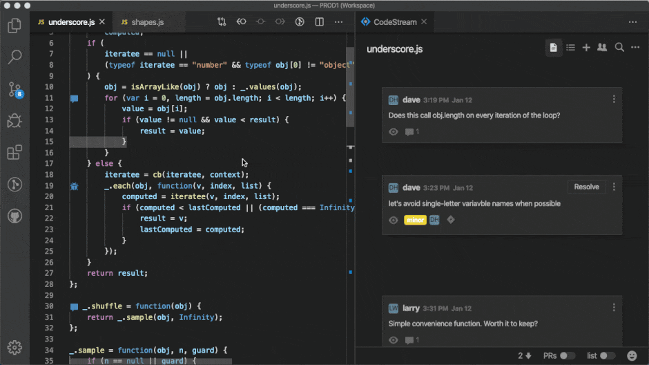
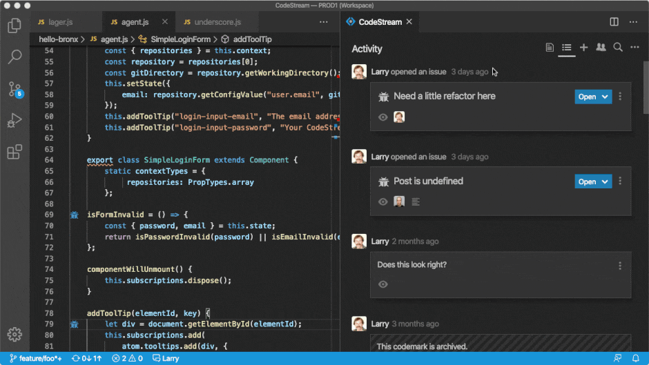
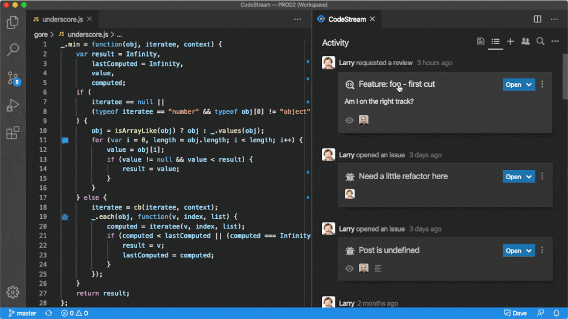
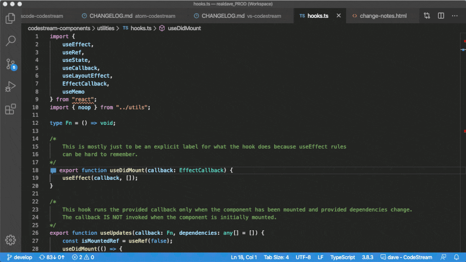
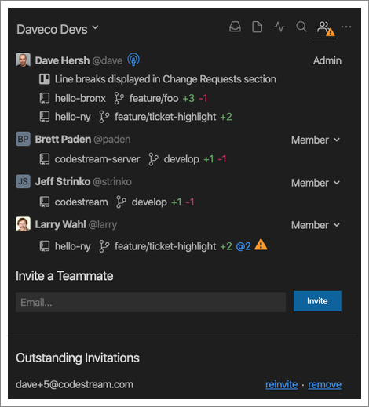

CodeStream is developer collaboration platform that makes it incredibly easy for
development teams, especially remote teams, to discuss and review code in a more
natural and contextual way. CodeStream not only makes discussions easier, by
allowing them to happen in your IDE, in context, but also preserves the
institutional knowledge that is currently being lost in Slack channels and
emails. 

## Discuss Code Just Like Commenting on a Google Doc

Simply select a block of code and type your question or comment. Teammates can
participate in the discussion right from their IDE, and you can optionally share
the discussion on Slack or Microsoft Teams so teammates can participate from
their chat clients as well. 

## In-IDE Code Review

CodeStream's lightweight code reviews let you request a review on any code
regardless of the current state of your repo, without the friction of
committing, pushing or issuing a pull request.

Your teammates can review your changes right in their IDE, with full file
context, and with no need to set aside their current work to switch branches or
pull the latest. 

CodeStream’s code reviews are so easy that you can start doing them throughout
the development process instead of waiting until the end. You’re a few days into
a sprint and have some work stubbed out? Maybe some work that hasn’t even been
committed. Request of a review of your work-in-progress so that you can identify
and resolve issues early instead of saving those gotchas for when you need to
get the code merged.

## Build the Knowledge Base Behind Your Codebase

CodeStream turns conversation into documentation by capturing all of the
discussion about your code, and saving it with your code. Comment and code
review threads are automatically repositioned as your code changes, even across
branches. All with zero effort on your part.

Previously discussed questions and issues that explain important decisions are
now accessible right where you need them, when you need them. Just click on the
codemark to expand it and see how something works or why something was done a
certain way.

## Team Transparency through Live View

Development is a collaborative activity, yet much of it happens in isolation,
with work only shared with the team at the end of a cycle, or sprint.
CodeStream’s “LiveView” increases transparency by making the local edits of
individual developers visible to team members, so that everyone knows what
everyone else is working on, in real-time.

As developers write code, whether editing existing files or creating new files,
a summary of their changes, including the repo(s), files, and lines changed is
exposed to their teammates through CodeStream. The information is displayed
contextually, in the IDE, and even warns teammates of potential merge conflicts…
before they happen!

