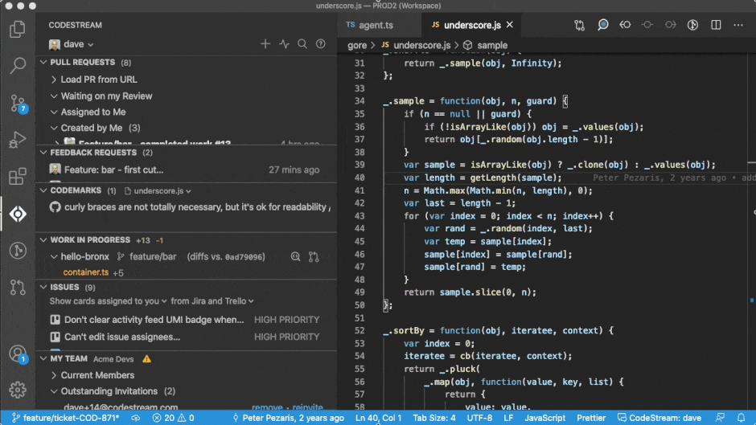
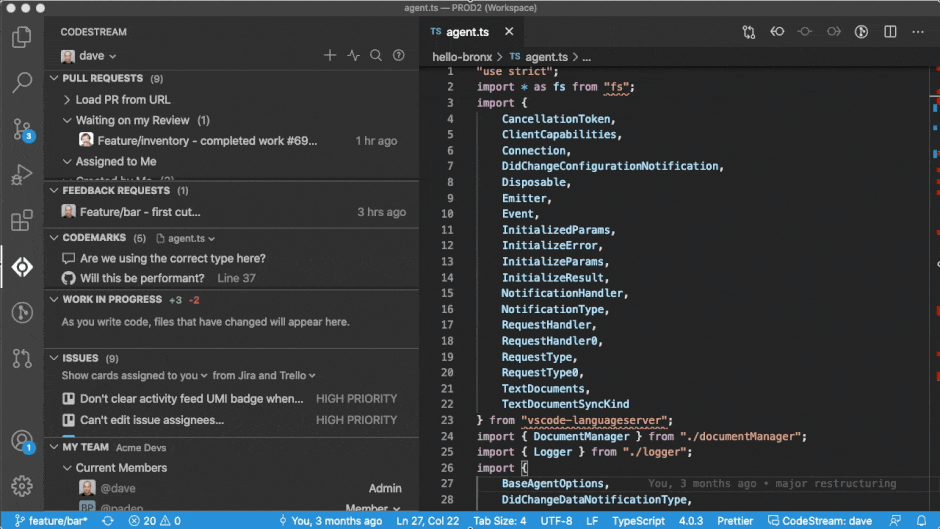
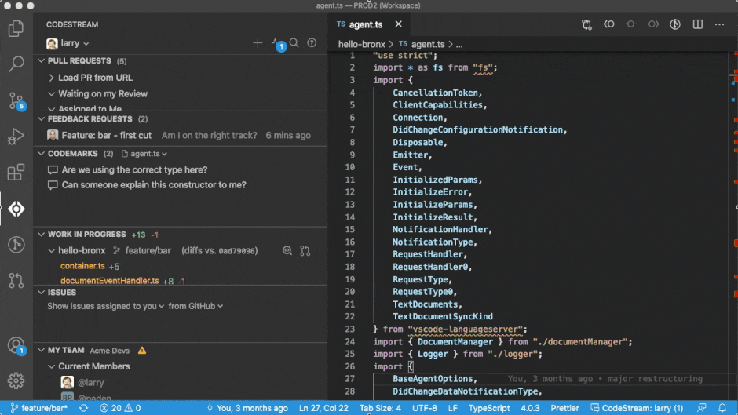
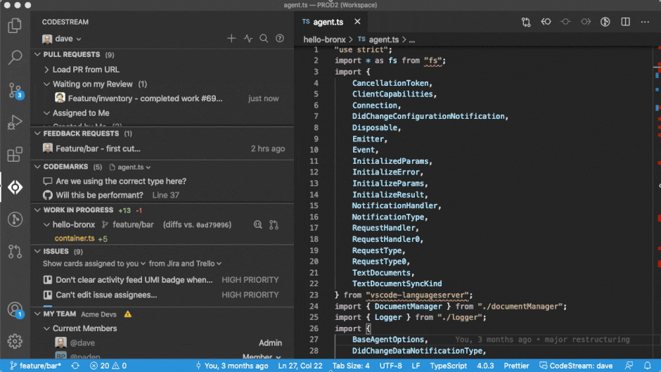
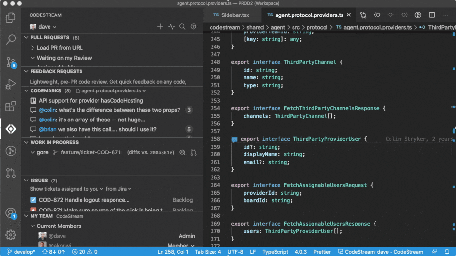

CodeStream is developer collaboration platform that makes it incredibly easy for
development teams, especially remote teams, to discuss and review code in a more
natural and contextual way. CodeStream not only makes discussions easier, by
allowing them to happen in your IDE, in context, but also preserves the
institutional knowledge that is currently being lost in Slack channels and
emails. 

## Discuss Code Just Like Commenting on a Google Doc

Simply select a block of code and type your question or comment. Teammates can
participate in the discussion right from their IDE, and you can optionally share
the discussion on Slack or Microsoft Teams so teammates can participate from
their chat clients as well. 

## Get Feedback on Work in Progress with Pre-PR Code Review

CodeStream's lightweight feedback requests let you have someone look over your
changes regardless of the current state of your repo, without the friction of
committing, pushing or issuing a pull request.

Your teammates can review your changes right in their IDE, with full file
context, and with no need to set aside their current work to switch branches or
pull the latest. 

CodeStream’s code feedback requests are so easy that you can start doing them
throughout the development process instead of waiting until the end. You’re a
few days into a sprint and have some work stubbed out? Maybe some work that
hasn’t even been committed. Request of a review of your work in progress so that
you can identify and resolve issues early instead of saving those gotchas for
when you need to get the code merged.

## Create and Review Pull Requests

For most development teams, the final step in the development process is a pull
request. Even if your team has decided to use CodeStream's [feedback
requests](../workflow/feedback-requests) as a replacement for, and not just a precursor to,
your end-of-cycle PR-based code reviews, CodeStream allows you to keep all of
that workflow right in your IDE. You can create pull requests, and review pull
requests, right inside your IDE.

## Build the Knowledge Base Behind Your Codebase

CodeStream turns conversation into documentation by capturing all of the
discussion about your code, whether it was from a pull request, a feedback
request, or just an ad-hoc question/comment, and saving it with your code. And
the real magix is that the discussions are automatically repositioned as your
code changes, even across branches. All with zero effort on your part.

Previously discussed questions and issues that explain important decisions are
now accessible right where you need them, when you need them. Just click on the
codemark to expand it and see how something works or why something was done a
certain way.

