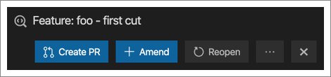
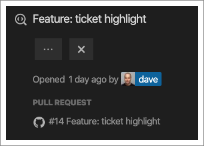
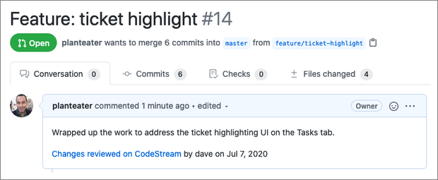

Hopefully you’re now doing lightweight frictionless code reviews right in your
IDE using CodeStream, but if your team uses pull requests they can still be part
of your workflow. For example, you may still want to use PRs to trigger CI/CD
and to get your code merged. You can now create that PR right from CodeStream.

Once your code review has been approved, you’ll see an option to create a PR at
the top of the review.

Note that before you can create a PR you’ll need to make sure that any changes
included in the code review have been committed and pushed.

You'll first be prompted to connect to GitHub, GitLab or Bitbucket (either cloud
or on-prem), and then you'll be able to enter the PR details. By default the
PR’s title and description are set to that of the code review, but you can edit
either as you see fit. You can also specify the compare branch for the PR.

If the feature branch you’re working doesn’t have a remote tracking branch
you’ll be given the option to set that as part of creating the PR.

Once the PR has been created, you’ll see a link to it at the top of the code
review. And note that the review may not be amended or reopened at this point.

When the PR is created on your code hosting service, it automatically includes a
reference to who did the code review, and when, as well as a permalink to the
code review on CodeStream.

