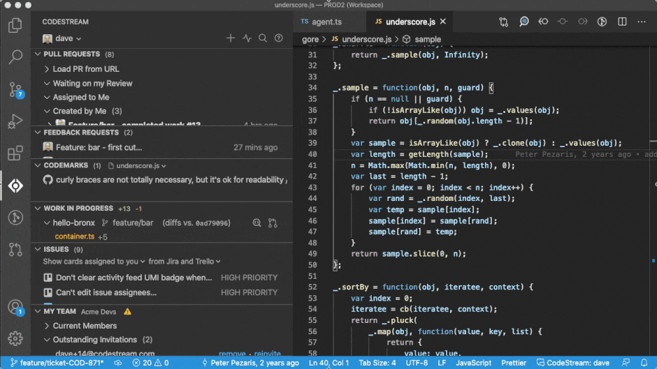

## What is a codemark?

Quite simply, a codemark is a discussion connected to the code. It could be a
question, a suggestion, a bug report, or documentation. All of these discussions
are saved, anchored to the blocks of code they refer to, so that they can be
leveraged in the future. It could be a new developer joining the team, a
developer trying to fix a bug in someone else’s code, or even just you trying to
remember why you made that change six months ago… whatever the case, CodeStream
helps you understand the code by surfacing the discussions in a contextual way.

Even as a file changes over time, the codemarks will remain connected to the
code. Add some new lines of code above the code block, make edits to the code,
or even cut-and-paste the entire block to a different section of the file, and
you’ll see the codemark move right along with the changes.

## Creating a codemark

Create a codemark by selecting a block of code in your editor and then clicking
on one of the icons that appears in the CodeStream pane next to your selection.

If you're using a JetBrains IDE, such as IntelliJ, you can also create a
codemark by using the "+" button that appears on hover, or on selection of a
code block, in the editor's gutter. The following animation shows three
different ways to use this button.

Even when the CodeStream pane is closed or not in view, you can create a
codemark via the CodeStream options in either the lightbulb or context menus.

Lastly, you can also look for the "+" at the top of the CodeStream pane.

Need to reach teammates that don’t spend a lot of time in the IDE? Or maybe some
teammates that aren’t yet on CodeStream? You can optionally share a codemark out
to Slack or Microsoft Teams. The Slack integration even allows your teammates to
reply directly from Slack.

## Comment Codemarks

The all-purpose codemark for linking any type of discussion to a block of code.
Ask a question. Make a suggestion. Document some code. Make note of key sections
of the codebase. The possibilities are endless!

## Issue Codemarks

When something needs to get done there’s always a better chance of it happening
if it’s captured as an issue, with someone’s name attached. Assign issues as a
way of reporting bugs. Or manage your tech debt by capturing items as tracked
issues instead of inline FIXMEs. 

If your team uses Jira (cloud or Server), Azure DevOps, Trello, Asana, GitHub
(cloud or Enterprise), Bitbucket (cloud), GitLab (cloud or Self-Managed) or
YouTrack for tracking issues, you can create an issue on one of those services
directly from CodeStream. Just select the service you use from the dropdown at
the top of the codemark form. Note that the Jira Server integration requires [a
little up-front work](../faq/jira-server-integration) from your Jira
administrator.

After going through the authentication process with the selected service you'll
now be able to select a destination for your issue. For example, with Jira
you'll be able to select the appropriate issue type and project.

Once the issue has been created on CodeStream, it will include a link to the
issue that was created on the external service. In the example below you'll see
the URL for the issue on Jira.

And the issue on Jira includes a link to open the relevant code in your IDE.

## Bringing the right people into the discussion

When you create a codemark, CodeStream automatically mentions the people that
most recently touched of the code you are commenting on. They may be the best
people to answer your question, but you can, of course, remove those mentions
and manually mention someone else if appropriate.

It may be the case that the people that have touched the code aren't yet on
CodeStream, in which case CodeStream will provide checkboxes to have them
notified via email. They can simply reply to the email to have their comment
posted to CodeStream, and of course they can install CodeStream to participate
from their IDE.

## Different versions of the code?

Maybe you’re on a feature branch, have local changes, or simply haven’t pulled
in a while. There are countless reasons why the code you’re looking at might be
different than what a teammate is looking at, and as a result, there will be
plenty of times when the code referenced in a codemark doesn’t match what you
have locally.

CodeStream recognizes these situations and includes the original version of the
code block (i.e. at the time the codemark was created), the current version, and
a diff. You can also use the “Apply” button to apply the code block in your
editor.

Keep in mind that with CodeStream you can discuss any line of code, in any
source file, at any time, even if it’s code that you just typed into your editor
and haven’t yet saved or committed. CodeStream allows you to discuss code at the
very earliest stages of the development process.

## Advanced Features

### Multiple Ranges

Many discussions about code involve more than just one block of code, and
concepts are often best presented when you can refer to multiple code locations
at once. Here are a few examples of multi-range codemark at work:

* A change to a function is being contemplated that will impact its name. Each
  instance of the function call can now be referenced in one discussion. 
* A react component and its CSS styling aren’t interacting well, and you want to
  ask the team for input. You might select the div and the CSS rules you think
  should apply, so your teammates know exactly what you’re talking about.
* Clients which make API calls to the server might get an unexpected result.
  Select the code where you’re making the API call, and the handler in the API
  server, to connect the two actions together.

To create a multi-range codemark, click on "+ Add Code Block".

And then select another block of code from the same file, a different file, or
even a different repo.

You can intersperse the difference code blocks in your post by referring to each one as `[#N]` (or click the pin icon from one of the code blocks to insert the markdown for you), as in the following example.

And here's how that example is rendered.

Once you've created the codemark, you can easily jump between the different
locations by clicking the Jump icon at the bottom-right of each code block.

Note that when you edit a codemark you can add and remove code blocks, and you
can change the location of any of the code blocks by clicking the dashed square
icon.

### Tagging

Look for the tag icon inside the codemark compose box to either select a tag or
create a tag using any combination of color and text label.

Tags are a great way to broadly organize and group your team’s codemarks, and
the possibilities here are endless. Note that you can also filter by tag on the
[Filter & Search page](../features/filter-and-search).

### Related Codemarks

Click on the CodeStream icon in the codemark compose form to select other,
related codemarks to “attach” to the current codemark. This allows you to easily
establish a connection between different parts of a codebase. For example, when
a change to one part of the codebase would require a change to another part,
identify the dependency by creating two related codemarks.

Once you’ve added the related codemarks they’ll be displayed in a “Related”
section and you can click on any one to jump to that codemark and the
corresponding section of the code.

## Managing Codemarks

Click on the ellipses menu for any codemark and you'll see options for managing the codemark.

* Share - In addition to sharing to Slack or Teams at the time you create a
  codemark, you can also share it anytime thereafter.
* Follow/Unfollow - Unfollow to stop receiving
  [notifications](../features/notifications) for the codemark.
* Copy link - Get a [permalink](../features/permalinks) for the codemark to
  share it anywhere.
* Archive - If there’s a codemark that you don’t think is important enough to be
  on permanent display in a given file, but you don’t want to completely delete
  it, you can archive it instead. Settings in the [Codemarks
  section](../features/codemarks-section) allow you to easily see all archived
  codemarks.
* Edit - Only the codemark's author can edit it.
* Delete - Only the codemark's author can delete it, but we encourage you to
  archive instead of delete unless you're positive the codemark won't have any
  future value.
* Inject as Inline Comment - If you'd like a specific codemark to become part of
  the repo use this option to have it added as an inline comment. You can select
  the appropriate format, and then indicate if you want to include timestamps,
  replies, or to have the comment wrapped at 80 characters. You can also elect
  to have the codemark archived once it's been added as an inline comment.
* Reposition Codemark - In most cases, a codemark will automatically remain
  linked to the block of code it refers to as the file changes over time. For
  example, if you cut the block of code and paste it at a different location in
  the file, the codemark will move right along with it. There are some
  scenarios, however, that CodeStream isn't able to handle automatically. For
  example, if you pasted the block of code into a different file. In these
  cases, Reposition Codemark allows you to select the new location of the block
  of code so that the codemark is displayed properly.