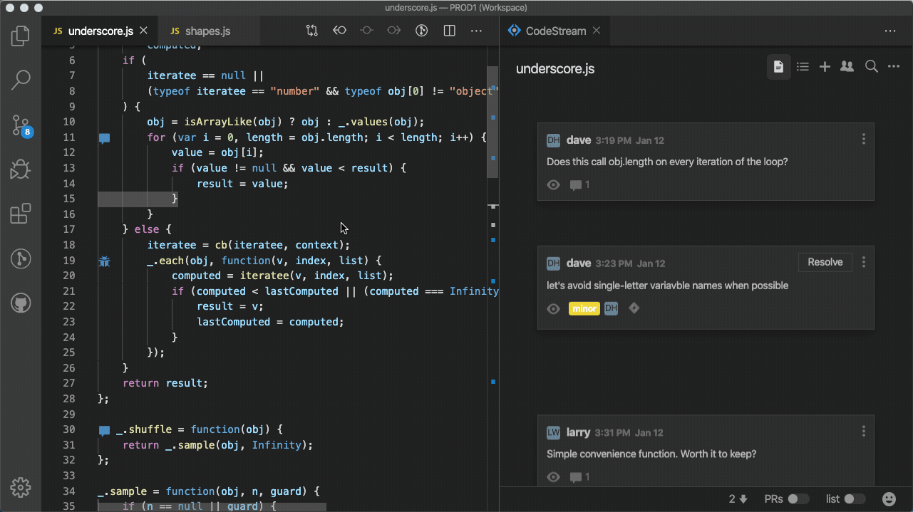

## What is a codemark?

Quite simply, a codemark is a discussion connected to the code. It could be a
question, a suggestion, a bug report, or documentation. All of these discussions
are saved, anchored to the blocks of code they refer to, so that they can be
leveraged in the future. It could be a new developer joining the team, a
developer trying to fix a bug in someone else’s code, or even just you trying to
remember why you made that change six months ago… whatever the case, CodeStream
helps you understand the code by surfacing the discussions in a contextual way.

Even as a file changes over time, the codemarks will remain connected to the
code. Add some new lines of code above the code block, make edits to the code,
or even cut-and-paste the entire block to a different section of the file, and
you’ll see the codemark move right along with the changes.

## Creating a codemark

Create a codemark by selecting a block of code in your editor and then clicking
on one of the icons that appears in the CodeStream pane next to your selection.

Even when the CodeStream pane is closed or not in view, you can create a
codemark via the CodeStream options in either the lightbulb or context menus.

Lastly, you can also look for the "+" at the top of the CodeStream pane.

Need to reach teammates that don’t spend a lot of time in the IDE? Or maybe some
teammates that aren’t yet on CodeStream? You can optionally share a codemark out
to Slack or Microsoft Teams. The Slack integration even allows your teammates to
reply directly from Slack.

### Comment Codemarks

The all-purpose codemark for linking any type of discussion to a block of code.
Ask a question. Make a suggestion. Document some code. Make note of key sections
of the codebase. The possibilities are endless!

### Issue Codemarks

When something needs to get done there’s always a better chance of it happening
if it’s captured as an issue, with someone’s name attached. Assign issues as a
way of reporting bugs. Or manage your tech debt by capturing items as tracked
issues instead of inline FIXMEs. 

CodeStream integrates with issue-tracking services such as Jira, Trello, GitHub,
and others so you can create an issue on one of those services directly from
CodeStream. Learn more about [CodeStream's issue-tracking
integrations](../features/issue-tracking-integrations).

## Bringing the right people into the discussion

When you create a codemark, CodeStream automatically mentions the people that
most recently touched of the code you are commenting on. They may be the best
people to answer your question, but you can, of course, remove those mentions
and manually mention someone else if appropriate.

It may be the case that the people that have touched the code aren't yet on
CodeStream, in which case CodeStream will provide checkboxes to have them
notified via email. They can simply reply to the email to have their comment
posted to CodeStream, and of course they can install CodeStream to participate
from their IDE.

## Different versions of the code?

Maybe you’re on a feature branch, have local changes, or simply haven’t pulled
in a while. There are countless reasons why the code you’re looking at might be
different than what a teammate is looking at, and as a result, there will be
plenty of times when the code referenced in a codemark doesn’t match what you
have locally.

CodeStream recognizes these situations and includes the original version of the
code block (i.e. at the time the codemark was created), the current version, and
a diff. You can also use the “Apply” button to apply the code block in your
editor.

Keep in mind that with CodeStream you can discuss any line of code, in any
source file, at any time, even if it’s code that you just typed into your editor
and haven’t yet saved or committed. CodeStream allows you to discuss code at the
very earliest stages of the development process.

[Learn more about codemarks](../features/creating-codemarks)