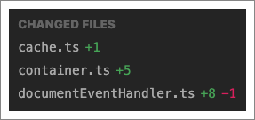
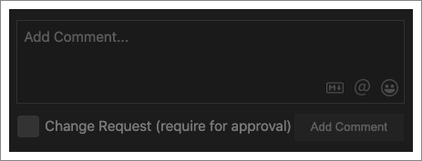
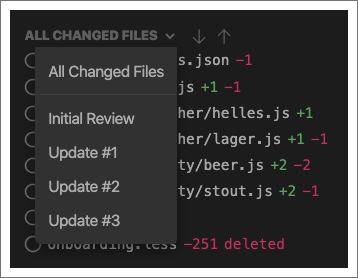

**Feedback Requests are currently available in
CodeStream’s extensions for VS Code, JetBrains, and Visual Studio.**

CodeStream's Feedback Requests are powerful enough to use for tradtional
end-of-cycle code reviews, but at the same time they're so easy and flexible
that you can use them throughout the development process to get quick feedback
on your work in progress. Even if you haven't committed your changes!

Traditional code review happens at the end of the development cycle, when you’re
looking to get the changes merged. Not only are end-of-cycle code reviews much
more burdensome on your teammates, but you run the risk of identifying issues so
late in the game that you end up having to decide between blowing up your
schedule or taking on technical debt.

Whether you’re at the very beginning of a project, with just some stubbed out
functions, are mid-way through a work in progress, or are ready for a final
review of a finished project, CodeStream allows you to get feedback at any point
during the development cycle. CodeStream handles the complexity of sharing your
current status, including pushed commits, local commits, and staged and saved
changes. Teammates can provide feedback right from their IDE, with no need to
switch applications, and no need to switch branches or pull changes.

By the time you get to that formal code review/pull request at the end of the
development cycle, it’s far less painful and more of a formality because issues
have been raised, discussed and resolved all along the way.

## Requesting feedback

Request feedback at any time, regardless of the current state of your work, by
clicking on the "+" button at the top of the CodeStream pane, or the "+"
button in the header of the Feedback Requests section. You can also use a
keyboard shortcut (`ctlr+shift+/` `r`, or `ctrl+/` `r` on a Mac).

With a single click you can name the feedback request based on the last commit
message, the branch name, or, if you [started work by selecting a
ticket](start-work), the ticket title. CodeStream assumes that you are
requesting feedback on changes in the repo/branch of the file currently selected
in your editor. If you have multiple repositories open in your IDE, you can
change this via the repo dropdown at the very top of the form. 

Depending on [your team's
settings](../features/managing-the-team/#code-review-assignment--approval),
CodeStream may suggest some reviewers. Based on the commit history of the code
being changed, the suggestions may even include someone that isn't yet on your
CodeStream team (in which case they'd be notified via email). Hover over a
reviewer’s name to see more details or to remove them. If multiple reviewers are
assigned you may also have the option to determine whether any of them can
approve the review, or if each one has to approve it individually.

The Changed Files section lists all of the files that have been added, removed
or modified. Click on any file to view a diff if you want to review your changes
before submitting the feedback request.

If you have a file that’s not suitable for review, such as a checked-in binary
file, you can hover over any file and click the "x" to exclude that file from the
feedback request. That file will be moved to a list below the form. Note that
new files are, by default, excluded from the feedback request, but you can hover
over their entry in the list and click "+" to add them.

Hover over an excluded file and click on the trashcan to permanently exclude it
from all future feedback requests. Permanently excluding files creates a
.codestreamignore file in the repository. If you think your teammates will also
want to exclude these files (e.g., a package-lock.json or other system-generated
file), you can commit and push the file so that they can make use of it as well.

The changes represented across the selected files are broken out into four
different categories, allowing you to select exactly what you would like to
include in the feedback request. This includes changes that haven't been pushed,
or event committed!

* Saved Changes
* Staged Changes
* Local Commits
* Pushed Commits

Note that commits are listed in descending order across the Local Commits and
Pushed Commits sections, and unchecking the box for a commit will automatically
uncheck the boxes for all preceding commits. In other words, the commits
included in the feedback request must be consecutive. Only your commits are
checked by default, but you can include any of them in your review. (Tip: Make
sure the email address in your git configuration matches your CodeStream email
address. Or, ask your CodeStream team's admin to set up a [blame
map](../features/myteam-section) to map your git email address to you CodeStream
email address.)

Lastly, you can optionally share the feedback request out to either Slack or
Microsoft Teams.

When you submit your feedback request, teammates will be notified via the
activity feed, with anyone assigned as a reviewer being @mentioned so that
they’ll also receive an email notification. 

## Providing feedback

The best part of CodeStream's feedback requests is that having your teammates
look over your code doesn't put any extra burden on them. No need for them to
set aside their own work to switch branches or pull changes, and no need to for
them to leave their IDE. As long as they have the appropriate repo, they can
simply open the feedback request and start reviewing the changes.

Click on any file in the Changed Files section to review the changes. You’ll be
presented with a diff in your editor, and you can step through the changes in
the file using your IDE's native navigation or the up/down arrows in the
Changed Files section. Note that for JetBrains IDEs, CodeStream doesn't
currently support the "Unified viewer" for diffs. Just the "Side-by-side
viewer".

Typically, the diff will represent the changes in the branch associated with the
feedback request (i.e., usually a feature/topic branch) against the base branch,
at the point at which the feature branch was created. Note that with CodeStream
diffs this may not always be the case since the developer may not have included
all of their changes in the feedback request. As a result, the version of the
files that the changes are being diff’ed against may, in fact, also include
changes that aren’t in the base branch. This is important in order to provide
continuity.

### Comments & Change Requests

If you have a general comment about the changes, just add a reply to the
feedback request's thread.

But if you want to comment on the actual changes, just select some code from the
right side of the diff and then click on the comment button that appears in the
CodeStream pane next to your selection. You can also use a keyboard shortcut
(`ctlr+shift+/` `c`, or `ctrl+/` `c` on a Mac) after selecting some code.

Since you have the full file context, you aren’t limited to commenting on just
the lines of code that changed. For example, you might notice another part of
the file that needs work as well, or that you simply want to reference.

Whether it’s a general comment or a comment on code, you can mark it a “change
request” to let the developer know that it’s required before you’ll approve the
changes. 

While you are providing feedback, you can even comment on files that are not
part of the changeset, and they will get added as a reply to the review. This is
helpful to be able to point your teammate to another location in the codebase
that might be an example of a better way to do something.

All of the change requests associated with the the feedback request are
summarized in a section at the top, in addition to being part of the discussion
thread. This is where they will get marked complete when the work is done.

Look for the green and red buttons at the top to either approve or reject the
changes. Note that if there are any open change requests, the approve button
will be replaced by a blue button that indicates the number. You can still
approve the changes but we wanted to make sure you were aware of the outstanding
work.

When there are multiple reviewers, and approval is required from each,
CodeStream makes it very clear when there are still outstanding approvals. The
blue button at the top-right indicates how many approvals are outstanding, and
the green “thumbs up” on the headshots of reviewers indicates those that have
already approved.

## Adding more code changes

A typical workflow involves the reviewer leaving some comments or suggesting
some changes, and then the developer responding to that feedback with more
changes to the code. To continue the process, click the blue Amend button to add
your changes.

As when you originally submitted the feedback request, you can choose from your
saved and stages changes, and your local and pushed commits. Any open change
requests are listed as well so that you can mark off any that are addressed by
the update.

When the reviewer goes back into the feedback request, by default they’ll be
looking at the complete changeset (i.e., changes across all updates) as they go
through the diffs for each file. They can, however, elect to view the diffs
specific to any individual update.

This process can continue across as many updates as needed to get to the
ultimate approval of the changes. And once the feedback request has been
approved, you can [create a pull request](pull-requests), right from CodeStream,
to get your code merged. Note that the feedback request may not be amended or
reopened once a pull request has been created.

