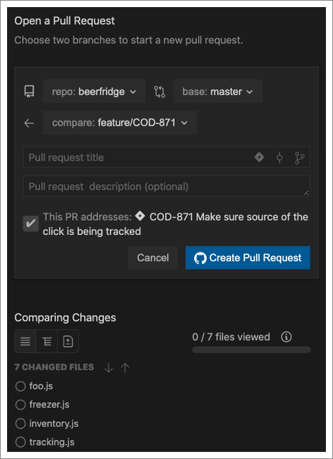

For most development teams, the final step in the development process is a pull
request. Even if your team has decided to use CodeStream's [feedback
requests](feedback-requests) as a replacement for, and not just a precursor to,
your end-of-cycle PR-based code reviews, CodeStream allows you to keep all of
that workflow right in your IDE.

## Creating a pull request

Open a pull request at any time by clicking on the "+" button at the top of the
CodeStream pane, or the "+" button in the header of the Pull Requests
section. You can also use a keyboard shortcut (`ctlr+shift+/` `p`, or `ctrl+/`
`p` on a Mac... and you can use `m` if you're a GitLab user). CodeStream even
provides you with different options (tree view, list view, diff hunks) for
reviewing your changes before opening the pull request.

With a single click you can name the pull request based on the last commit
message, the branch name, or, if you [started work by selecting a
ticket](start-work), the ticket title. If you have a ticket selected, you can
also explicitly tie the ticket to the pull request, and CodeStream will include
a link to the ticket in the pull request's description. Before submitting the
pull request you can even review your changes by clicking on any of the files
listed below the form.

You can also create a pull request from within a CodeStream feedback request.
Once the feedback request has been approved, you’ll see an option to open a pull
request at the top.

Before you can create a pull request you’ll need to make sure that any changes
included in the feedback request have been committed and pushed. Also, if the
feature branch you’re working on doesn’t have a remote tracking branch you’ll be
given the option to set that as part of creating the pull request.

When you create a pull request from a feedback request, CodeStream connect's the
dots between the two by adding a link to the pull request to the feedback
request.

And by adding a link to the feedback request, along with information about who
did the review and when, in the description of the pull request.

## Reviewing a pull request

**The ability to review pull requests is currently available for GitHub and
GitHub Enterprise.**

Regardless of where the pull request was created, you can edit, review, and even
merge it, right from CodeStream. We've essentially brought GitHub right into
your IDE, so there's zero learning curve. If you know how to work with pull
requests on GitHub, you'll know how to do it in CodeStream as well.

Edit the pull request's details, such as reviewers, assignees and labels.

Review the conversation and add comments.

View the changes, add comments, and submit a review.

Of course, we did improve upon the GitHub experience in a couple of important
ways. On GitHub you can only view the changes as a series of "diff hunks".
CodeStream provides that view as well, but if you'd prefer to see the changes in
the context of the full file, and not just the lines that changed, you can use
either List View or Tree View. Just select the code you want to comment on, and
then cick on the Comment button (or select Comment from the context menu).

When commenting you can either add a single comment, or start a review.

Another difference from GitHub is that CodeStream allows you to comment on lines
of code that haven't changed. You can select ANY lines of code in the diff, and
not just those that are part of the changeset. Note that these comments are
added as a "single comment" to the pull request and aren't part of any review
you may have in progress.

All the power of GitHub pull requests, and then some, right in your IDE.