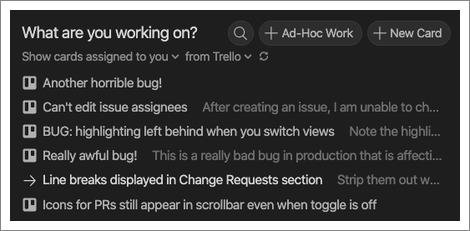

When you want to get started on some new work, whether it’s a modest bug fix or
a major new feature, there are a lot of steps and different services involved.
Go to your issue tracking service, find all of the tickets assigned to you,
select one to work on, and update its status. Now head to your terminal, or
GitHub, to create a feature branch. And lastly, update your status on Slack to
let your teammates know what you’re working on. With CodeStream, you can do this
all in one step, right from your IDE.

To get started, head to the Tasks tab in CodeStream and connect to your team’s
issue tracking service.

Once you’re connected, you’ll be able to see all of the tickets assigned to you,
filtering by project, board, list, etc., as you see fit. 

You can view any ticket on the appropriate issue tracking service.

Or just click on a ticket to get started!

If your team uses a feature branch Git workflow, you can create a branch to do
your work on. Expand the dropdown for options to change repos, edit the branch
name, change the base branch, or select an existing branch.

If you’re a team admin, you can even set up a branch naming template for the
team so that all of the team’s feature branches get named in a consistent
manner.

Depending on which issue tracking service you use, you can also choose to update
the ticket’s status. For example, if you use Trello, you’ll be able to move the
selected card to another list (e.g., “In Progress”).

If you need to work on something that doesn’t have an associated ticket you can
either click “Ad-hoc Work” to get started without a ticket, or click “New Item”
to create a ticket in your issue tracking service right from CodeStream. You can
even associate that ticket with a block of code in your editor!
